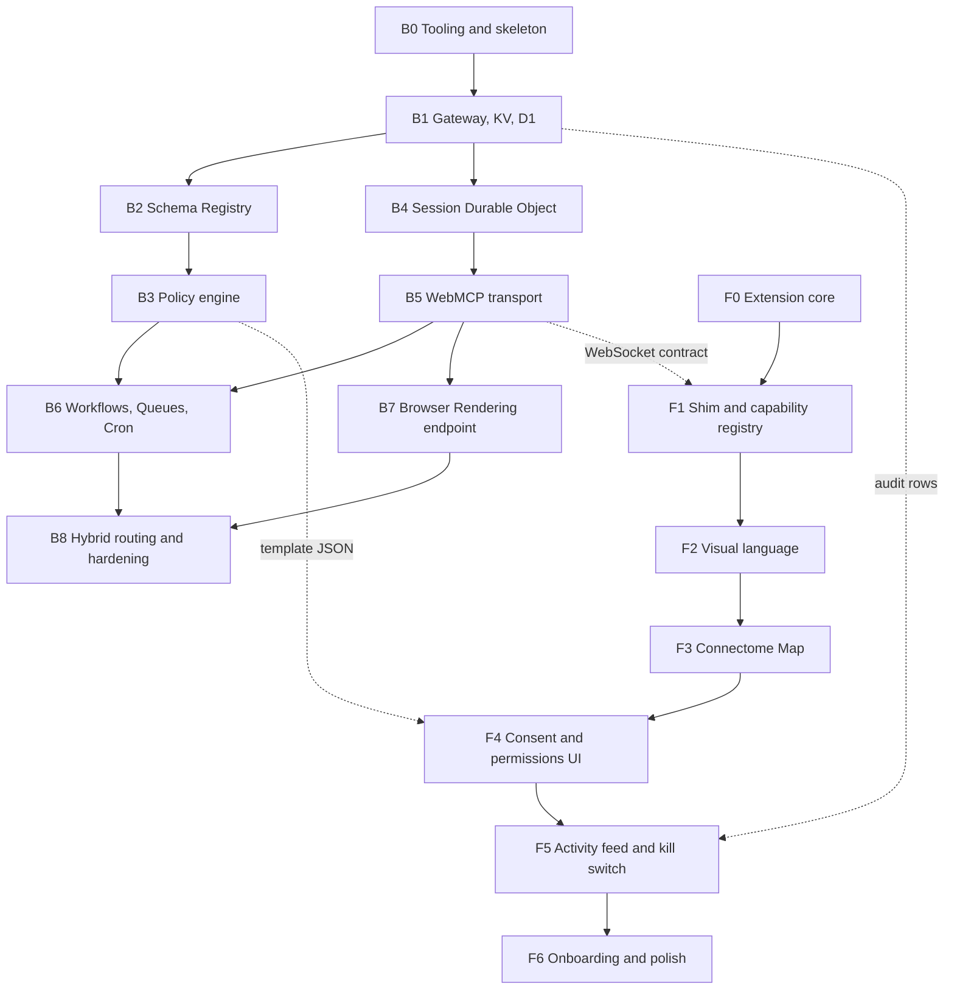
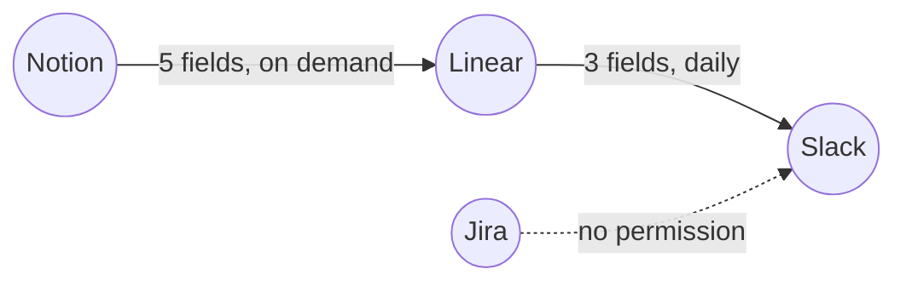

# Connectome: Developer Build Plan

**Source of truth:** `connectome-expansion.md` (the Connectome Expansion Document).
**Audience:** a junior developer who knows JavaScript/TypeScript and has never shipped a Cloudflare Worker or a Chrome extension before.
**Promise of this document:** you should never have to guess. Every task tells you what to build, how to build it, and how to know you are done.

---

## 0. How to use this plan

### 0.1 Read this first (5 minutes)

Connectome lets an AI agent use the web apps you already use (Linear, Notion, Slack, Jira) by talking to them through a small piece of code injected into the page, called the **WebMCP shim**. Two things can host that shim:

1. A **browser extension** running in a tab you have open (free, uses your login).
2. A **cloud browser** running on Cloudflare Browser Rendering (works when your laptop is closed).

Both speak the exact same protocol, so the rest of the system does not care which one is used. That single idea is the backbone of this whole plan. If you remember nothing else, remember: **an endpoint is anything that can execute a WebMCP tool call.**

Three safety systems sit around it:

| System | One-line job | Where it lives |
|---|---|---|
| **Schema Registry (CBOs)** | Defines what a `Task` or `Contact` *is*, the same way for every app | Cloudflare KV |
| **Permission Templates** | Defines where data may *go*, field by field | Cloudflare KV, enforced in the gateway Worker |
| **Audit Trail** | Records everything that happened, in human language | Cloudflare D1 |

### 0.2 Task format

Every task in this plan looks like this:

> **`B1-03` Short imperative title**
> **Why:** one sentence of purpose, so you know what breaks if you skip it.
> **Do:** numbered, literal steps.
> **Done when:** a checklist you can verify yourself, without asking anyone.

Rules for you, the developer:

- **One task = one commit = one pull request.** If a task feels like two things, it is a bug in the plan: split it and tell the team.
- **Never start a task whose "Depends on" is unfinished.** Dependencies are listed at the top of each phase.
- **If a task takes more than one day, stop and ask.** Every task here is scoped to between 30 minutes and 6 hours.
- **"Done when" is not optional.** A task with an unchecked box is not done, even if the code works on your machine.

### 0.3 Vocabulary you must know before writing code

| Term | Plain-English meaning |
|---|---|
| **Worker** | A small function that runs on Cloudflare's servers when an HTTP request arrives. No server to manage. |
| **Durable Object (DO)** | A tiny single-threaded server with its own private storage, addressable by a name. One per user here. "Single-threaded" means two requests can never run at the same time inside it, which is why it is safe for state. |
| **KV** | A globally cached key-value store. Fast reads everywhere, slow to update (a few seconds). Perfect for schemas. |
| **D1** | A real SQL database (SQLite) you can query. Used for the audit log. |
| **Queues** | A list of jobs a Worker picks up later. |
| **Cron Trigger** | "Run this Worker at 9am daily." |
| **Workflows** | Cloudflare's durable step runner: each step is saved, retried on failure, and can sleep for days waiting for a human. |
| **Browser Rendering** | A headless Chrome you drive from a Worker with Puppeteer. |
| **CBO** | Canonical Business Object. A versioned JSON Schema, for example `cbo://task/1.2.0`. |
| **Mapping profile** | A YAML/JSON file that says "Linear's `.state.type` becomes CBO `status`". Data, not code. |
| **Permission template** | A signed JSON grant: this data, from this app, to this app, this often, until this date. |
| **Endpoint** | Extension or cloud browser. Anything that can run a WebMCP tool call. |

### 0.4 Repository layout (create this on day one)

```text
connectome/
  packages/
    protocol/          # shared TypeScript types: WebMCP messages, CBOs, templates
    shim/              # the WebMCP in-page shim (used by BOTH extension and cloud browser)
    registry-data/     # CBO JSON Schemas + mapping profiles, as plain files in git
  backend/
    gateway/           # Cloudflare Worker: API + policy engine
    session-do/        # Durable Object: per-user session brain
    workflows/         # Cloudflare Workflows definitions
    browser-endpoint/  # Browser Rendering driver
    migrations/        # D1 SQL migrations
  frontend/
    extension/         # Chrome extension (MV3)
    ui/                # shared React components: map, consent, activity feed
  docs/
```

**Why `packages/protocol` and `packages/shim` are shared:** the single biggest source of bugs in this system would be the extension and the cloud browser drifting apart. Keeping one shim and one set of types in one place makes drift impossible.

### 0.5 Prerequisites checklist (do this before Phase B0)

- [ ] Node.js 20+ and `pnpm` installed.
- [ ] A Cloudflare account with Workers Paid plan (Durable Objects and Browser Rendering require it).
- [ ] `pnpm add -g wrangler` and `wrangler login` succeeds.
- [ ] Google Chrome installed, and you know how to open `chrome://extensions` and toggle Developer Mode.
- [ ] A free Linear account with 3 or 4 test issues. This is our reference app all the way through.
- [ ] A Slack workspace you own with a `#standup` channel. This is our reference destination app.

---

## 1. Phase map



**Order of work if you are one developer:** B0, B1, F0, F1, B4, B5 (this gets you a real end-to-end call), then B2, B3, F2, F3, F4, then B6, B7, F5, F6, B8.

**Order of work if you are two developers:** one takes the backend column, one takes the frontend column. They meet at the three dotted contracts in the diagram, which are frozen in `packages/protocol` during B0.

---
# PART A: BACKEND

Everything in Part A runs on Cloudflare. You will not install a server, a Docker container, or a database daemon anywhere.

**Backend golden rules (tape these to your monitor):**

1. **Deny by default.** If the policy engine cannot find an approved template for a call, the answer is no. Never write an `else { allow }`.
2. **The agent is untrusted.** Treat every request from the agent as if a stranger wrote it, because a prompt injection means one did.
3. **The agent never supplies a URL.** It supplies an app name; the backend resolves the pinned origin. This kills phishing-by-navigation.
4. **Every state change writes an audit row.** No exceptions, not even for failures. Especially not for failures.
5. **Secrets never leave the edge.** No token, cookie, or key is ever returned in an API response or sent to the extension.

---

## Phase B0: Tooling and skeleton

**Goal:** a monorepo that deploys a "hello world" Worker and holds the frozen types both halves of the team code against.
**Depends on:** section 0.5 prerequisites.
**Exit criteria for the phase:** `pnpm deploy:gateway` puts a live URL on the internet, and `packages/protocol` exports the WebMCP message types.

> **`B0-01` Create the monorepo skeleton**
> **Why:** everything else assumes these folders exist, and getting them right once saves a painful refactor later.
> **Do:**
> 1. `mkdir connectome && cd connectome && pnpm init`.
> 2. Create `pnpm-workspace.yaml` with `packages: ['packages/*', 'backend/*', 'frontend/*']`.
> 3. Create the exact folder tree from section 0.4. Put a one-line `README.md` in each folder saying what lives there.
> 4. Add a root `tsconfig.base.json` with `"strict": true`. Do not turn strict off later; it is the cheapest bug-finder you have.
> 5. `git init`, commit as `chore: monorepo skeleton`.
> **Done when:**
> - [ ] `pnpm install` completes with no errors.
> - [ ] `git log` shows one commit and `git status` is clean.
> - [ ] Every folder in section 0.4 exists and has a README.

> **`B0-02` Freeze the WebMCP message contract in `packages/protocol`**
> **Why:** the extension and the cloud browser must speak byte-identical messages. Writing the types first makes that automatic instead of hopeful.
> **Do:**
> 1. In `packages/protocol/src/webmcp.ts` define these types exactly:
>    ```typescript
>    export type ToolCallRequest = {
>      type: 'tool_call';
>      call_id: string;        // uuid v4, generated by the gateway
>      app: string;            // 'linear' (a NAME, never a URL)
>      tool: string;           // 'list_issues'
>      args: Record<string, unknown>;
>      workflow_run_id: string;
>      deadline_ms: number;    // endpoint must give up after this
>    };
>
>    export type ToolCallResult =
>      | { type: 'tool_result'; call_id: string; ok: true; data: unknown }
>      | { type: 'tool_result'; call_id: string; ok: false; error: ConnectomeError };
>
>    export type ConnectomeError = {
>      code:
>        | 'APP_UNAVAILABLE'      // no endpoint can reach this app right now
>        | 'ORIGIN_FORBIDDEN'     // Tier 3 hard block
>        | 'CONSENT_REQUIRED'     // Tier 2, waiting on the human
>        | 'BUDGET_EXCEEDED'      // action budget hit
>        | 'AUTH_REQUIRED'        // landed on a login page
>        | 'POLICY_DENIED'        // no template allows this
>        | 'SCHEMA_INVALID'       // payload failed CBO validation
>        | 'TOOL_FAILED';         // the app itself errored
>      message: string;          // human-readable, safe to show a user
>      details?: Record<string, unknown>;
>    };
>    ```
> 2. Define the endpoint-to-gateway messages: `EndpointHello` (endpoint id, kind `'extension' | 'cloud'`, list of reachable apps), `CapabilityUpdate` (apps added or removed), `Heartbeat`.
> 3. Export everything from `packages/protocol/src/index.ts`.
> **Done when:**
> - [ ] `pnpm --filter protocol build` produces `.d.ts` files with no errors.
> - [ ] Every error code above is present. This list is closed: adding a code later requires a team decision, because the frontend renders a specific UI for each one.
> - [ ] `ToolCallRequest` contains no field that can hold a URL. Grep for `url` and confirm zero hits.

> **`B0-03` Deploy a hello-world gateway Worker**
> **Why:** you must prove your Cloudflare account, login, and deploy pipeline work before any real logic exists, or you will debug three things at once.
> **Do:**
> 1. `cd backend/gateway && pnpm create cloudflare@latest . --framework=none --ts`.
> 2. Replace the fetch handler with one that returns `{ ok: true, service: 'connectome-gateway', version: '0.0.1' }` as JSON for `GET /health`, and 404 for everything else.
> 3. `wrangler deploy`.
> 4. Add `"deploy:gateway": "pnpm --filter gateway exec wrangler deploy"` to the root `package.json` scripts.
> **Done when:**
> - [ ] `curl https://<your-worker>.workers.dev/health` returns the JSON above.
> - [ ] `curl https://<your-worker>.workers.dev/nope` returns HTTP 404.
> - [ ] `pnpm deploy:gateway` works from the repo root.

> **`B0-04` Create the KV namespaces and the D1 database**
> **Why:** these three resources are referenced by nearly every later task; creating them now means no later task is blocked on infrastructure.
> **Do:**
> 1. `wrangler kv namespace create REGISTRY` (holds CBO schemas and mapping profiles).
> 2. `wrangler kv namespace create TEMPLATES` (holds permission templates).
> 3. `wrangler d1 create connectome-audit`.
> 4. Paste all three returned bindings into `backend/gateway/wrangler.toml`.
> 5. Repeat the `--preview` variants so `wrangler dev` works locally.
> **Done when:**
> - [ ] `wrangler kv key put --binding=REGISTRY test hello` then `wrangler kv key get --binding=REGISTRY test` prints `hello`.
> - [ ] `wrangler d1 execute connectome-audit --command "SELECT 1"` returns a row.
> - [ ] `wrangler dev` starts with no binding warnings.

> **`B0-05` Add lint, format, and a CI check**
> **Why:** a junior-friendly codebase is one where the machine, not a reviewer, catches style problems.
> **Do:**
> 1. Add ESLint with `@typescript-eslint` and Prettier at the root.
> 2. Add `"check": "tsc -b && eslint . && prettier --check ."`.
> 3. Add `.github/workflows/ci.yml` that runs `pnpm install` then `pnpm check` on every pull request.
> **Done when:**
> - [ ] `pnpm check` passes locally.
> - [ ] A deliberately badly-formatted test commit fails CI, and reverting it makes CI pass.

---

## Phase B1: Gateway, identity, and the audit trail

**Goal:** an authenticated API surface that records everything it does.
**Depends on:** B0 complete.
**Exit criteria:** an authenticated request produces a queryable row in D1.

> **`B1-01` Add request routing and a typed error responder**
> **Why:** consistent error shapes are what let the frontend render a helpful UI instead of "something went wrong".
> **Do:**
> 1. Install `hono` in the gateway. Replace the raw fetch handler with a Hono app.
> 2. Create routes as stubs returning HTTP 501: `POST /v1/tool-call`, `GET /v1/endpoints`, `GET /v1/templates`, `POST /v1/templates`, `GET /v1/audit`, `GET /v1/registry/:cbo`.
> 3. Write `fail(code, message, details?)` that returns `{ error: ConnectomeError }` from `packages/protocol` with the right HTTP status: 403 for `POLICY_DENIED` and `ORIGIN_FORBIDDEN`, 409 for `CONSENT_REQUIRED`, 422 for `SCHEMA_INVALID`, 429 for `BUDGET_EXCEEDED`, 503 for `APP_UNAVAILABLE`.
> 4. Register a global `onError` handler so an unexpected throw becomes `TOOL_FAILED` and never leaks a stack trace.
> **Done when:**
> - [ ] Every route above responds (501 is fine).
> - [ ] A route that throws on purpose returns a clean `TOOL_FAILED` JSON body with no stack trace in it.
> - [ ] Each error code maps to the documented HTTP status; verify with six curl commands.

> **`B1-02` Implement user identity and the auth middleware**
> **Why:** every piece of state in this system is scoped to a user; without a `user_id` you cannot route to a Durable Object.
> **Do:**
> 1. Choose bearer-token auth for v1: the extension sends `Authorization: Bearer <jwt>`.
> 2. Add a middleware that verifies the JWT signature using a secret from `wrangler secret put JWT_SIGNING_KEY`, then sets `c.set('userId', claims.sub)`.
> 3. Reject a missing, expired, or bad-signature token with HTTP 401 and no detail about which of the three it was.
> 4. Apply the middleware to every `/v1/*` route except `/health`.
> **Done when:**
> - [ ] A request with no header returns 401.
> - [ ] A request with a token signed by the wrong key returns 401.
> - [ ] A valid token reaches the handler and `c.get('userId')` is the expected string.
> - [ ] `grep -r "JWT_SIGNING_KEY" backend/` shows the name only, never a value, and the value is not in git.

> **`B1-03` Create the D1 audit schema and migration**
> **Why:** the audit trail is a product feature, not a debug log. Users will read it, so its shape matters.
> **Do:**
> 1. Write `backend/migrations/0001_audit.sql`:
>    ```sql
>    CREATE TABLE audit_events (
>      id            TEXT PRIMARY KEY,
>      user_id       TEXT NOT NULL,
>      occurred_at   INTEGER NOT NULL,      -- epoch ms
>      workflow_run_id TEXT,
>      template_id   TEXT,
>      app           TEXT,
>      tool          TEXT,
>      endpoint_kind TEXT,                  -- 'extension' | 'cloud'
>      decision      TEXT NOT NULL,         -- 'allowed' | 'denied' | 'consent_required'
>      reason        TEXT,                  -- WHY, in human language
>      payload_json  TEXT,                  -- only when the template says full_payload
>      retention_until INTEGER NOT NULL
>    );
>    CREATE INDEX idx_audit_user_time ON audit_events (user_id, occurred_at DESC);
>    CREATE INDEX idx_audit_run ON audit_events (workflow_run_id);
>    ```
> 2. Apply it locally and remotely with `wrangler d1 migrations apply`.
> **Done when:**
> - [ ] The table and both indexes exist in the remote database.
> - [ ] `reason` is a human sentence field, and you have written down one example: `"allowed by template standup-summary-v1 (fields: title, status)"`.
> - [ ] `retention_until` is populated by the writer, not defaulted, so retention comes from the template.

> **`B1-04` Write the audit writer helper**
> **Why:** if writing an audit row is more than one line of code, developers will skip it under deadline pressure.
> **Do:**
> 1. Create `audit.write(env, event)` that fills `id` (uuid), `occurred_at` (now), and `retention_until` (now + template retention days, default 30).
> 2. Make it never throw: wrap in try/catch and `console.error` on failure, because a failed audit write must not break a legitimate user action. Log loudly enough that you notice.
> 3. Call it from the `onError` handler so unexpected failures are also audited with `decision: 'denied'`.
> **Done when:**
> - [ ] One call inserts one row; verify with `wrangler d1 execute --command "SELECT * FROM audit_events"`.
> - [ ] Forcing a D1 error still returns a normal API response to the caller.
> - [ ] A deliberately thrown handler error produces both a `TOOL_FAILED` response and an audit row.

> **`B1-05` Implement `GET /v1/audit` with paging**
> **Why:** the frontend activity feed (F5) is built directly on this endpoint, and it must be paged from day one or it will fall over after a week of use.
> **Do:**
> 1. Accept `?limit=` (default 50, max 200), `?before=<epoch_ms>`, and optional `?app=` and `?run=` filters.
> 2. Scope every query to `user_id` from the token. Never accept a `user_id` query parameter; that is a data-leak bug waiting to happen.
> 3. Return `{ events: [...], next_before: <epoch_ms | null> }`.
> **Done when:**
> - [ ] Inserting 120 test rows and paging with `limit=50` returns 50, 50, then 20, and `next_before` is null on the last page.
> - [ ] Passing another user's id in any parameter cannot return their rows. Write a test that proves it.
> - [ ] `limit=9999` is clamped to 200.

> **`B1-06` Add a scheduled retention purge**
> **Why:** templates promise a retention period, and a promise you do not enforce is a lie in your privacy policy.
> **Do:**
> 1. Add `[triggers] crons = ["0 3 * * *"]` to `wrangler.toml`.
> 2. In the `scheduled` handler, `DELETE FROM audit_events WHERE retention_until < ?` with now, in batches of 1000.
> 3. Write one audit row recording how many rows were purged.
> **Done when:**
> - [ ] `wrangler dev --test-scheduled` plus a curl to `/__scheduled` deletes an expired test row and leaves a fresh one.
> - [ ] The purge itself appears in the audit table.

---
## Phase B2: Schema Registry (Canonical Business Objects)

**Goal:** CBO schemas and mapping profiles live in git, publish to KV, archive to R2, and can validate and translate a real Linear issue into a canonical `Task`.
**Depends on:** B1 complete.
**Exit criteria:** a real Linear issue JSON goes in, a valid `cbo://task/1.x` object comes out, and an invalid one is rejected with a readable error.

> **`B2-01` Author the `Task` CBO schema**
> **Why:** `Task` is the object every later phase demos with. Get its shape right and the other 14 are copy-and-adjust work.
> **Do:**
> 1. Create `packages/registry-data/cbo/task/1.2.0.json` using the schema in section 2.1 of the source document, verbatim.
> 2. Add a `x-data-class` annotation to every field that could carry sensitive data. Example: `assignee.email` gets `"x-data-class": "pii.email"`, `assignee.display_name` gets nothing.
> 3. Keep `status` and `priority` as closed enums, and keep `extensions` with `additionalProperties: true`.
> 4. Write a five-line comment at the top of the file explaining the lossless round-trip rule: the app's original value always survives in `extensions`.
> **Done when:**
> - [ ] The file validates as a legal JSON Schema (draft 2020-12) using `ajv compile`.
> - [ ] `required` is exactly `["id", "title", "status", "source"]`.
> - [ ] Every field carrying PII or money has an `x-data-class` annotation. List them in the PR description.

> **`B2-02` Author the remaining 14 CBOs**
> **Why:** the catalog is what makes one permission template work across every app that maps to it.
> **Do:**
> 1. Create one file per CBO from the catalog table: `Project`, `Comment`, `Attachment`, `Contact`, `Company`, `Deal`, `Activity`, `Message`, `Thread`, `Meeting`, `Document`, `Page`, `Invoice`, `Order`, `Customer`, plus the shared `Person`.
> 2. Every one of them gets the mandatory `source` block and an `extensions` object. Copy them from `Task`; do not invent variations.
> 3. Start every file at version `1.0.0`.
> **Done when:**
> - [ ] All 16 files compile with `ajv`.
> - [ ] A script asserts each file has `source` and `extensions`, and it passes.
> - [ ] No two files define the same concept twice. If `Customer` and `Contact` overlap, write a comment in each saying which to use when.

> **`B2-03` Write the registry publish script**
> **Why:** KV is the runtime source, but git must be the editing source, or nobody will ever know why a schema changed.
> **Do:**
> 1. Write `scripts/publish-registry.ts` that walks `packages/registry-data/`, and for each file writes KV key `cbo:task:1.2.0` and also a floating pointer `cbo:task:1.x` holding the newest 1.x version string.
> 2. Upload the identical bytes to R2 under `registry/cbo/task/1.2.0.json`, and refuse to overwrite an existing R2 object.
> 3. Add `pnpm publish:registry`.
> **Done when:**
> - [ ] After running it, `wrangler kv key get --binding=REGISTRY cbo:task:1.x` returns `1.2.0`.
> - [ ] Running it twice is safe and changes nothing.
> - [ ] Editing a published version and re-running fails with a clear message telling you to bump the version. This immutability is the point.

> **`B2-04` Implement the CBO validator in the gateway**
> **Why:** validation at the boundary is what turns a corrupt cross-app write into a clean, user-visible error.
> **Do:**
> 1. Add `ajv` to the gateway. Compile schemas lazily and cache compiled validators in module scope so repeated calls in the same Worker isolate are cheap.
> 2. Write `validateCbo(env, cboRef, payload)` that resolves `1.x` to a concrete version via KV, then validates.
> 3. On failure return `SCHEMA_INVALID` with `details.errors` containing a human list like `"status must be one of backlog, todo, in_progress, blocked, done, canceled (received: 'Triage')"`.
> **Done when:**
> - [ ] A valid Task passes.
> - [ ] A Task with `status: "Triage"` fails with the exact readable message above, not an ajv error object dump.
> - [ ] A missing `source` block fails.
> - [ ] Validating 100 objects in one request compiles the schema only once. Prove it with a counter.

> **`B2-05` Define the mapping-profile format and write the Linear profile**
> **Why:** deterministic mapping is the difference between a demo and a product. The profile is data, so it can be reviewed, signed, and shipped without a code deploy.
> **Do:**
> 1. Write a JSON Schema for the profile format itself, supporting exactly these constructs and nothing more: a direct path (`.title`), a `from` + `map` enum fold, a `from` + `via` sub-profile reference, and a `write_back` block with `allowed_fields`.
> 2. Create `packages/registry-data/profiles/linear-issue-to-cbo-task.yaml` from the example in section 2.1 of the source document.
> 3. Create `linear-user-to-cbo-person.yaml` so the `via` reference resolves.
> **Done when:**
> - [ ] Both profiles validate against the profile schema.
> - [ ] A profile using an unsupported construct is rejected. Test it with a made-up `transform: javascript` key.
> - [ ] `write_back.allowed_fields` is present and does not include any field annotated as PII.

> **`B2-06` Implement the deterministic mapping engine**
> **Why:** this is the function that must never call an LLM. Its whole value is being boringly predictable.
> **Do:**
> 1. Write `applyProfile(profile, nativeObject)` supporting only the four constructs from B2-05.
> 2. Always write the untouched native value of any folded field into `extensions.native_<field>`, so the round-trip is lossless.
> 3. Always populate `source` with `{ app, native_type, url }` from the profile's app record.
> 4. Collect any native field the profile does not mention into `unmapped: string[]` in the return value, and do not silently drop it.
> **Done when:**
> - [ ] A real Linear issue JSON maps to a Task that passes `validateCbo`.
> - [ ] Linear's `Triage` state produces `status: "backlog"` and `extensions.native_status: "Triage"`.
> - [ ] Adding an unknown field to the input returns it in `unmapped` and does not throw.
> - [ ] The function contains zero network calls. Grep for `fetch` and confirm zero hits.

> **`B2-07` Add the unmapped-field proposal queue**
> **Why:** this is how the registry *learns* instead of guessing the same thing wrong every run.
> **Do:**
> 1. When `unmapped` is non-empty, write a row to a new D1 table `mapping_proposals` with `user_id`, `app`, `native_field`, `sample_value`, `suggested_target` (default `extensions.<field>`), `status: 'pending'`.
> 2. Expose `GET /v1/proposals` and `POST /v1/proposals/:id/accept`.
> 3. On accept, append the mapping to the profile and bump its minor version through the publish path from B2-03. Never patch KV directly.
> **Done when:**
> - [ ] Mapping an issue with an unknown `cycle` field creates exactly one pending proposal, not one per run. Deduplicate on `(app, native_field)`.
> - [ ] Accepting it produces a new profile version in git-published KV, and the next map returns an empty `unmapped`.
> - [ ] A rejected proposal is never re-proposed.

---

## Phase B3: Policy engine and permission templates

**Goal:** deny by default, enforced in front of everything, with a dry-run mode.
**Depends on:** B2 complete.
**Exit criteria:** an identical tool call is denied without a template and allowed with one, and both outcomes are in the audit log.

> **`B3-01` Author the permission-template JSON Schema**
> **Why:** templates are the security boundary. If their format is loose, the enforcement is loose.
> **Do:**
> 1. Create `packages/registry-data/schema/permission-template.1.0.0.json` covering every field in the example from section 2.2: `template_id`, `name`, `source` (app, cbo, fields, filter), `destination` (app, cbo, operation, constraint), `conditions` (max_invocations, data_classes_forbidden, valid_until), `audit` (level, retention_days).
> 2. Constrain `destination.operation` to the closed enum `["create", "update", "read"]`. There is deliberately no `delete`.
> 3. Make `source.fields`, `conditions.valid_until`, and `audit.retention_days` all required. No template may be unbounded in time.
> **Done when:**
> - [ ] The example template from the source document validates.
> - [ ] A template with `operation: "delete"` is rejected.
> - [ ] A template with no `valid_until` is rejected.

> **`B3-02` Implement template signing and verification**
> **Why:** a stored template that can be edited by anything other than the approval flow is not a grant, it is a suggestion.
> **Do:**
> 1. On approval, canonicalize the template JSON (sorted keys, no whitespace) and sign it with HMAC-SHA256 using a `TEMPLATE_SIGNING_KEY` secret, via WebCrypto.
> 2. Store `{ template, signature, signed_at, signed_by }` in KV under `tpl:<user_id>:<template_id>`.
> 3. Verify the signature on every read. A bad signature is `POLICY_DENIED` plus a loud audit row, never a silent repair.
> **Done when:**
> - [ ] A template written by the approval flow verifies.
> - [ ] Hand-editing one byte in KV makes the next call fail with `POLICY_DENIED` and produce an audit row whose reason says the signature failed.
> - [ ] The signing key never appears in any API response. Grep the whole gateway for it.

> **`B3-03` Implement the field-level allowlist filter**
> **Why:** "App A can talk to App B" is the coarse permission model this whole design exists to replace.
> **Do:**
> 1. Write `projectFields(cboObject, allowedFields)` that returns a NEW object containing only the allowed paths, supporting dotted paths like `assignee.display_name`.
> 2. Anything not listed is dropped, not nulled. The destination app must never learn a field exists.
> 3. Always keep `source` (needed for provenance) and never keep `extensions` unless a template explicitly lists `extensions.*`.
> **Done when:**
> - [ ] `["title", "status", "assignee.display_name"]` on a full Task returns exactly those three paths plus `source`.
> - [ ] `assignee.email` is absent from the output object, and `JSON.stringify` of the result contains no email string.
> - [ ] The input object is not mutated. Assert deep equality against a clone.

> **`B3-04` Implement the data-class firewall**
> **Why:** this is the second, independent line of defense: even if a field mapping would technically allow a value through, a forbidden data class blocks it.
> **Do:**
> 1. Walk the outgoing payload, look up each leaf path's `x-data-class` in the CBO schema, and compare against `conditions.data_classes_forbidden`.
> 2. Support prefix matching: forbidding `pii` blocks `pii.email` and `pii.phone`.
> 3. Additionally run a value-level scan for anything that looks like an email, a bearer token, or a private key, even in fields with no annotation. Block on a hit and audit it as a possible mapping bug.
> 4. Order matters: run this AFTER field projection, on the exact bytes about to leave.
> **Done when:**
> - [ ] A payload containing `pii.email` under a template forbidding `pii.email` is blocked with `POLICY_DENIED`.
> - [ ] Forbidding `pii` blocks a `pii.phone` field.
> - [ ] Pasting an email address into a `title` field is caught by the value scan and audited.
> - [ ] A clean payload passes with no false positive. Test with a title containing the `@` character in normal prose.

> **`B3-05` Implement rate limits and action budgets**
> **Why:** budgets bound the damage of a prompt-injected or looping agent, and they must be enforced outside the agent to mean anything.
> **Do:**
> 1. Enforce `conditions.max_invocations` (for example `1/day`) per template per user, counted in the Session DO's storage (it is strongly consistent, unlike KV).
> 2. Enforce a per-workflow-run budget: max 5 navigations and max 10 tool calls per app, as constants in one config file with a comment saying where they came from.
> 3. On exhaustion return `BUDGET_EXCEEDED` and pause the run rather than failing it, so a human can approve more.
> **Done when:**
> - [ ] The second invocation of a `1/day` template on the same day returns `BUDGET_EXCEEDED`.
> - [ ] The counter resets on the calendar boundary in the user's timezone, not UTC. Write down which timezone field you used.
> - [ ] An 11th tool call in one run to one app is refused, and the run state says `paused_awaiting_budget`, not `failed`.

> **`B3-06` Wire the policy engine into `POST /v1/tool-call`**
> **Why:** the engine only counts if nothing can route around it. Placement in front of the Session DO is the security property.
> **Do:**
> 1. Implement this exact order, and add a code comment saying the order is load-bearing:
>    1. Authenticate.
>    2. Resolve the app name to a pinned origin from the user's connection record. Reject any request containing a URL outright.
>    3. Load and verify the template.
>    4. Check Tier 3 denylist.
>    5. Check budget.
>    6. Validate the input against its CBO.
>    7. Project fields.
>    8. Run the data-class firewall.
>    9. Write the audit row.
>    10. Only now forward to the Session DO.
> 2. If any step fails, return its typed error and still write an audit row.
> **Done when:**
> - [ ] A call with no matching template returns `POLICY_DENIED` and never reaches the DO. Prove it with a log line inside the DO that stays silent.
> - [ ] A call containing a `url` field is rejected before anything else runs.
> - [ ] The audit row is written before forwarding, so a crash mid-forward still leaves a record.
> - [ ] All ten steps appear in that order in one readable function under 80 lines.

> **`B3-07` Implement dry-run mode**
> **Why:** the source document requires every template's first run to show the user exactly what would move, before anything moves.
> **Do:**
> 1. Accept `?dry_run=true` and force it automatically when a template has never had a successful real execution.
> 2. Run every step through the firewall, then return the exact would-be payload and the human sentence "this would create 1 message in #standup containing 3 task titles", without calling the endpoint.
> 3. Mark the template as `first_run_completed` only after the user approves the dry-run result.
> **Done when:**
> - [ ] The first-ever call for a template is a dry run even without the query parameter.
> - [ ] The dry-run response contains the post-projection payload, so what the user sees is exactly what would be sent.
> - [ ] No audit row with `decision: 'allowed'` and no endpoint call happens during a dry run. Verify the endpoint received nothing.

---
## Phase B4: Session Durable Object (the session brain)

**Goal:** one Durable Object per user that owns the endpoint registry, the workflow checkpoints, and the socket to the extension.
**Depends on:** B1 complete. Can be built in parallel with B2 and B3.
**Exit criteria:** the extension connects, the DO knows which apps are reachable, and the state survives a deploy.

> **`B4-01` Create the Session DO class and route to it by user**
> **Why:** a DO is the only Cloudflare primitive with strongly consistent state and no race conditions, which is exactly what a live user session needs.
> **Do:**
> 1. Create `backend/session-do/src/SessionDO.ts` exporting a class with a `fetch` handler.
> 2. Bind it in the gateway `wrangler.toml` and get a stub with `env.SESSION.get(env.SESSION.idFromName(userId))`. Always `idFromName(userId)`, never `newUniqueId()`, so the same user always reaches the same object.
> 3. Add a `GET /debug/state` route inside the DO that dumps its storage as JSON, gated behind an admin token.
> **Done when:**
> - [ ] Two requests with the same `user_id` reach the same DO instance. Prove it with an in-memory counter that increments across both.
> - [ ] Two different `user_id`s get separate counters.
> - [ ] `/debug/state` requires the admin token and returns 401 without it.

> **`B4-02` Implement the endpoint registry inside the DO**
> **Why:** this registry is what turns "the tab is not open" from a crash into a recoverable, one-click state, and it is the data the Connectome Map renders.
> **Do:**
> 1. Store `endpoints: Record<endpointId, { kind, apps: string[], last_seen_ms, socket_open: boolean }>` in DO storage.
> 2. Implement `registerEndpoint`, `updateCapabilities`, `removeEndpoint`, and `whichEndpointServes(app)` returning `'extension' | 'cloud' | null`.
> 3. Treat an endpoint with `last_seen_ms` older than 90 seconds as gone.
> 4. Expose the whole registry through the gateway as `GET /v1/endpoints`.
> **Done when:**
> - [ ] Registering an extension advertising `["linear", "slack"]` makes `whichEndpointServes("linear")` return `'extension'`.
> - [ ] `whichEndpointServes("notion")` returns `null` and the gateway turns that into `APP_UNAVAILABLE`.
> - [ ] After 90 seconds with no heartbeat, the endpoint disappears from `GET /v1/endpoints`.

> **`B4-03` Implement workflow checkpointing in DO storage**
> **Why:** section 1.2 of the source document makes checkpointing the machinery that later stages reuse heavily. A missing app must pause a run, never abort it.
> **Do:**
> 1. Define `RunState = { run_id, template_id, status, cursor, step_results, paused_reason, created_at, updated_at }` with `status` in `running | paused_awaiting_app | paused_awaiting_consent | paused_awaiting_auth | paused_awaiting_budget | done | failed`.
> 2. Write `saveCheckpoint(run)` and `loadRun(run_id)` using `state.storage.transaction` so a partial write is impossible.
> 3. Write `resumeRun(run_id, reason)` that only resumes from a paused status and is idempotent: calling it twice must not run a step twice.
> **Done when:**
> - [ ] A run paused with `paused_awaiting_app` still loads after `wrangler deploy`.
> - [ ] Calling `resumeRun` twice in quick succession executes the next step exactly once. Test it with a counter.
> - [ ] Resuming a `done` run is a no-op that returns the existing result rather than an error.

> **`B4-04` Implement the app-unavailable pause and resume affordance**
> **Why:** this is the exact v0.5 behaviour the source document specifies: "Open Linear to continue this workflow."
> **Do:**
> 1. When a tool call targets an app no endpoint serves, save a checkpoint with `paused_awaiting_app`, and return `APP_UNAVAILABLE` with `details: { app, resume_token, human_action: "Open Linear to continue" }`.
> 2. When `updateCapabilities` later adds that app, look for runs paused on it and resume them automatically.
> 3. Expire a paused run after 24 hours with a final audit row, so nothing hangs forever.
> **Done when:**
> - [ ] Calling a tool for an unopened app returns `APP_UNAVAILABLE` and creates one paused run.
> - [ ] Opening the app in a tab resumes the run with no further API call from the frontend. This is the money demo for the phase.
> - [ ] A run paused for 25 hours is marked `failed` with a clear reason in the audit log.

---

## Phase B5: WebMCP transport over hibernated WebSockets

**Goal:** the gateway can send a tool call to a live extension and get a result back, at near-zero idle cost.
**Depends on:** B4 complete, and `packages/protocol` frozen in B0-02.
**Exit criteria:** a real Linear issue list, fetched through a real browser tab, returned from a curl to the gateway.

> **`B5-01` Accept a WebSocket upgrade in the DO with the Hibernation API**
> **Why:** hibernation is what lets thousands of idle connected users cost essentially nothing, and it changes how you write the handler, so build it in from the start.
> **Do:**
> 1. Handle the `Upgrade: websocket` request in the DO, and accept the socket with `this.state.acceptWebSocket(server)` (the hibernation form), NOT `server.accept()`.
> 2. Implement `webSocketMessage`, `webSocketClose`, and `webSocketError` as class methods. Never hold state in a closure over the socket, because hibernation destroys closures. All state goes in `state.storage` or a serialized attachment.
> 3. Use `serializeAttachment` to tag each socket with its `endpoint_id` and `kind`.
> **Done when:**
> - [ ] `wscat` connects successfully and echoes a message.
> - [ ] After 15 minutes idle the connection still works, and your logs show the handler ran without the closure state being present. Note in the PR that hibernation happened.
> - [ ] Reading `deserializeAttachment` inside `webSocketMessage` returns the correct `endpoint_id`.

> **`B5-02` Implement the request-response correlation layer**
> **Why:** a WebSocket is fire-and-forget; the HTTP caller needs a single answer. This is the plumbing that bridges the two, and it is where timeouts must live.
> **Do:**
> 1. On an outbound `ToolCallRequest`, store `pending[call_id] = { run_id, sent_at, deadline_ms }` in DO storage and send the frame.
> 2. On an inbound `ToolCallResult`, match `call_id`, clear the pending entry, and continue the run.
> 3. Set a DO alarm at the deadline. If it fires with the entry still pending, produce `TOOL_FAILED` with reason `endpoint timeout`.
> 4. Ignore any result whose `call_id` is unknown, and audit it as a protocol violation.
> **Done when:**
> - [ ] A round trip returns the endpoint's data to the HTTP caller.
> - [ ] An endpoint that never answers produces a timeout error after `deadline_ms`, not a hung request.
> - [ ] Sending a `ToolCallResult` with a random `call_id` is ignored and audited.
> - [ ] Two concurrent calls do not cross their results. Test with two calls whose payloads differ.

> **`B5-03` Implement heartbeat and reconnect**
> **Why:** the frontend shows a live "connected" state, and a lying indicator destroys user trust faster than an outage.
> **Do:**
> 1. The endpoint sends `Heartbeat` every 30 seconds; the DO updates `last_seen_ms`.
> 2. A DO alarm every 60 seconds prunes endpoints older than 90 seconds and marks their sockets closed.
> 3. On reconnect, the endpoint re-sends `EndpointHello` with its full app list, and the DO replaces rather than merges the capability list, so stale apps cannot linger.
> **Done when:**
> - [ ] Killing the extension makes the endpoint disappear from `GET /v1/endpoints` within 90 seconds.
> - [ ] Reconnecting restores it and any run paused on `paused_awaiting_app` resumes.
> - [ ] Reconnecting after closing one app tab shows a shorter app list, not the old one.

> **`B5-04` Build the shared WebMCP shim in `packages/shim`**
> **Why:** one shim used by both the extension and the cloud browser is the single most important structural decision in this codebase. Two shims means two behaviours and unreproducible bugs.
> **Do:**
> 1. Write a framework-free ES module exporting `installShim({ transport })` that registers tools on `window.__connectome`.
> 2. Make it **event-driven, never polled**: it reacts to an incoming message and posts a reply. No `setInterval`. This is what beats background-tab timer throttling, per section 1.3 of the source document.
> 3. Implement per-app tool modules with a tiny registry: `registerApp('linear', { list_issues, get_issue, update_issue })`.
> 4. Return raw native objects from the tools. The shim never maps to CBOs; mapping is the backend's job, so the trusted transformation stays server-side.
> **Done when:**
> - [ ] `grep -rn "setInterval\|setTimeout(.*poll" packages/shim/src` returns zero hits.
> - [ ] The module builds to a single file with no imports from `chrome.*`, so the cloud browser can use it unchanged.
> - [ ] `list_issues` returns real data when run in a Linear tab via the devtools console.
> - [ ] The same built file, pasted into a plain Chrome tab, still installs without errors.

> **`B5-05` Prove the full loop end to end**
> **Why:** this is the first moment the system is real. Everything before it is scaffolding.
> **Do:**
> 1. With the extension connected and a Linear tab open, `curl -X POST /v1/tool-call` with `{ app: "linear", tool: "list_issues" }`.
> 2. Write down the measured latency and put it in `docs/benchmarks.md`.
> 3. Record a 30-second screen capture and commit the link in the PR.
> **Done when:**
> - [ ] The curl returns real Linear issue titles.
> - [ ] The audit table has one row with `endpoint_kind: 'extension'` and `decision: 'allowed'`.
> - [ ] Closing the Linear tab makes the identical curl return `APP_UNAVAILABLE`.
> - [ ] `docs/benchmarks.md` has the number.

---

## Phase B6: Durable workflows, queues, and schedules

**Goal:** multi-step runs that survive a laptop closing, and a template that fires at 9am on its own.
**Depends on:** B3 and B5 complete.
**Exit criteria:** the standup template runs on a cron, pauses for consent, and completes hours later.

> **`B6-01` Create the first Cloudflare Workflow**
> **Why:** Workflows gives you retries, checkpoints, and multi-day sleeps as a managed primitive. Hand-rolling that is weeks of work and bugs.
> **Do:**
> 1. Create `backend/workflows/src/CrossAppFlow.ts` with steps: `read_source`, `map_to_cbo`, `check_policy`, `await_consent`, `write_destination`, `audit_complete`.
> 2. Each step calls the gateway or the DO. Keep every step idempotent, because Workflows retries them.
> 3. Give each step an explicit retry policy: retry a transport failure, never retry a `POLICY_DENIED`.
> **Done when:**
> - [ ] `wrangler workflows trigger` runs it to completion against test data.
> - [ ] Killing a step mid-run resumes from that step, not from the beginning.
> - [ ] A `POLICY_DENIED` step fails the run immediately with zero retries. A retried denial would be a security smell.

> **`B6-02` Implement the human-in-the-loop consent pause**
> **Why:** a consent pause that costs compute while waiting cannot support "ask me tomorrow". As a sleeping Workflow step, it costs nothing.
> **Do:**
> 1. Make `await_consent` a step that waits for an event with a 24-hour timeout.
> 2. Add `POST /v1/consent/:run_id` that sends that event with `{ decision: 'allow_once' | 'always' | 'deny' }`.
> 3. Default to deny on timeout, and audit the timeout explicitly.
> 4. On `always`, create or extend a permission template so the same question is never asked twice.
> **Done when:**
> - [ ] A run parked on consent shows `paused_awaiting_consent` in `GET /v1/runs/:id`.
> - [ ] Posting `allow_once` resumes it and it completes.
> - [ ] Posting `deny` ends the run cleanly with an audit row, and no destination write happened.
> - [ ] A 24-hour timeout is treated as deny.

> **`B6-03` Add Queues for burst absorption**
> **Why:** Browser Rendering has hard concurrency limits, so a queue is what turns a burst into a delay instead of a wall of errors.
> **Do:**
> 1. Create a queue `connectome-toolcalls`. Producer: the gateway when the target endpoint is `cloud`. Consumer: a Worker that drives the browser endpoint.
> 2. Set `max_batch_size` and `max_retries: 3`, and configure a dead-letter queue.
> 3. Write one audit row per dead-lettered message. Silent drops are unacceptable in a system users audit.
> **Done when:**
> - [ ] 50 queued calls all complete without exceeding the browser concurrency limit.
> - [ ] A permanently failing message lands in the dead-letter queue after 3 tries.
> - [ ] Every dead-lettered message has an audit row.

> **`B6-04` Add the Cron Trigger for scheduled templates**
> **Why:** this is the payoff of the whole cloud architecture: the standup posts at 9am whether or not the laptop is open.
> **Do:**
> 1. Add a cron that runs every 15 minutes, reads templates with a schedule, and computes which are due in the user's timezone.
> 2. For each due template, trigger `CrossAppFlow`.
> 3. Enforce idempotency with a `last_fired_at` key, so a retried cron cannot post the standup twice.
> **Done when:**
> - [ ] A template scheduled for the next quarter-hour fires exactly once.
> - [ ] Manually invoking the cron handler twice in the same window fires nothing the second time.
> - [ ] The audit row shows the run was cron-initiated, not user-initiated.

---

## Phase B7: Browser Rendering endpoint (laptop closed)

**Goal:** the same shim, the same protocol, running in a cloud browser.
**Depends on:** B5 complete.
**Exit criteria:** with the extension fully disconnected, a tool call still succeeds.

> **`B7-01` Drive a Browser Rendering session from a Worker**
> **Why:** prove the primitive works and measure its startup cost before designing around it.
> **Do:**
> 1. Add the `browser` binding. From a Worker, use `puppeteer.launch(env.BROWSER)`, open `example.com`, and return the page title.
> 2. Log cold-start duration to `docs/benchmarks.md`.
> **Done when:**
> - [ ] The endpoint returns the real page title.
> - [ ] The measured cold start is written down. Everyone will ask you for this number.
> - [ ] Closing the browser in a `finally` block is verified: no session leaks after 20 consecutive calls.

> **`B7-02` Inject the shared shim into a cloud page**
> **Why:** this is the moment the two transports become interchangeable, which is the central claim of the architecture.
> **Do:**
> 1. Bundle `packages/shim` to a single string at build time.
> 2. Use `page.evaluateOnNewDocument` to install it before page scripts run.
> 3. Execute a tool call through it and return the result in the same `ToolCallResult` shape the extension uses.
> **Done when:**
> - [ ] The cloud result JSON is byte-identical in shape to the extension result for the same tool. Diff two saved responses and show zero structural differences.
> - [ ] The shim version reported by both endpoints is the same string.

> **`B7-03` Implement session reuse and a warm pool**
> **Why:** the source document is explicit that "always-on cloud browser per user per app" is the wrong model. On-demand with reuse is the right one.
> **Do:**
> 1. Keep session ids in DO storage keyed by `(user, app)` and reconnect with `puppeteer.connect` when a session is still alive.
> 2. Close a session after 5 minutes idle via a DO alarm.
> 3. Cap concurrent sessions per account in one config constant, and queue past it (B6-03).
> **Done when:**
> - [ ] The second call within 5 minutes reuses the session, provably faster. Put both numbers in the benchmarks file.
> - [ ] Idle sessions are closed by the alarm, verified in the Cloudflare dashboard.
> - [ ] Exceeding the cap queues rather than erroring.

> **`B7-04` Implement per-app cloud auth onboarding**
> **Why:** this is the honest, consent-heavy path the source document mandates. There is a shortcut here (copying local cookies) and taking it would be a fireable decision.
> **Do:**
> 1. Prefer a native API where the app has one: store the OAuth token in Secrets Store and skip the browser entirely. Do this check first, every time.
> 2. For API-less apps, build a one-time interactive login: stream the cloud browser to the user, they sign in themselves, then encrypt the resulting cookies and store them in DO storage scoped to `(user, app)`.
> 3. On expiry, pause the run with `AUTH_REQUIRED` and re-prompt.
> 4. Write `docs/security.md` stating plainly: the extension never reads or exports local cookies, and add a CI grep that fails the build on `chrome.cookies`.
> **Done when:**
> - [ ] An app with an API never launches a browser. Prove it with a log assertion.
> - [ ] The interactive login works once and the next scheduled run needs no human.
> - [ ] Expired cookies produce `AUTH_REQUIRED` and a paused run, not a crash or a silent empty result.
> - [ ] `grep -rn "chrome.cookies" frontend/` returns zero hits and CI enforces it.

> **`B7-05` Detect auth pages and refuse to automate them**
> **Why:** security control 2 in the source document: the agent never sees or touches credentials. This must be enforced in code, not in a policy document.
> **Do:**
> 1. Write a classifier that inspects the page for password inputs, known OAuth consent hosts, and MFA markers.
> 2. If it matches, abort the tool call immediately with `AUTH_REQUIRED` and take no action on the page. Do not screenshot it, do not read the DOM into the result.
> 3. Apply the identical classifier in the extension path (F1-05), from the shared package, so both transports behave the same.
> **Done when:**
> - [ ] Pointing the endpoint at a login page returns `AUTH_REQUIRED` and performs zero clicks or keystrokes.
> - [ ] No password field value is ever present in any log, audit row, or result. Grep your logs to confirm.
> - [ ] The classifier lives in a shared package imported by both transports, not copy-pasted.

---

## Phase B8: Hybrid routing and hardening

**Goal:** "extension first, cloud fallback" with identical agent-facing behaviour, plus the operational safety net.
**Depends on:** B6 and B7 complete.
**Exit criteria:** the agent code never knows or cares which endpoint ran a call.

> **`B8-01` Implement the routing rule in the Session DO**
> **Why:** this is the elegant core of the architecture: v1 and v2 are not two products, they are two transports.
> **Do:**
> 1. For each call: if an extension endpoint serves the app and its socket is open, use it. Otherwise, if cloud auth exists for that app, use the cloud. Otherwise return `APP_UNAVAILABLE` with the resume affordance.
> 2. Put this decision in exactly one function, `chooseEndpoint(app)`, and record the chosen kind in the audit row.
> 3. Add a per-app user override: `prefer: 'extension' | 'cloud' | 'auto'`.
> **Done when:**
> - [ ] With a tab open, the audit row says `extension`.
> - [ ] With the browser closed, the identical call says `cloud` and still succeeds.
> - [ ] With neither available, the error carries the resume affordance.
> - [ ] Routing logic exists in exactly one function. Grep proves there is no second copy.

> **`B8-02` Implement the Tier 3 origin denylist**
> **Why:** some categories must be structurally impossible to automate, not merely discouraged.
> **Do:**
> 1. Ship a default denylist: banking, healthcare, government, `chrome://`, `about:`, browser extension pages, plus a user-defined list.
> 2. Check it in both the gateway and the extension. Two independent checks, because one of them will be bypassed some day.
> 3. A denylist hit returns `ORIGIN_FORBIDDEN` and audits at the highest severity.
> **Done when:**
> - [ ] A tool call for a denylisted origin fails in the gateway.
> - [ ] The same call also fails if it somehow reaches the extension directly. Test by calling the extension path with the gateway check disabled.
> - [ ] A user-added denylist entry takes effect without a redeploy.

> **`B8-03` Implement the global kill switch**
> **Why:** the source document requires an always-visible control that instantly freezes everything. It must work from the backend side even if the UI is broken.
> **Do:**
> 1. `POST /v1/kill` sets `paused: true` in the DO, rejects every in-flight and future tool call with `POLICY_DENIED` reason `agent paused by user`, and closes all cloud sessions.
> 2. Broadcast a `kill` frame to connected extensions so they close agent-opened tabs.
> 3. Require an explicit `POST /v1/resume`. Never auto-resume, not even after a restart.
> **Done when:**
> - [ ] Kill during a live run stops it within 2 seconds and audits it.
> - [ ] Every call while paused is denied with that exact reason.
> - [ ] The paused state survives a `wrangler deploy`.

> **`B8-04` Add Smart Placement and observability**
> **Why:** a DO in the wrong region adds seconds to every workflow, and you cannot fix latency you do not measure.
> **Do:**
> 1. Enable Smart Placement on the gateway Worker.
> 2. Emit Analytics Engine datapoints for tool-call latency, endpoint kind, and policy decision. Keep D1 for the user-facing log; use Analytics Engine for aggregates.
> 3. Add a `/health/deep` route checking KV read, D1 write, and DO reachability.
> **Done when:**
> - [ ] An Analytics Engine query returns p50 and p95 latency split by endpoint kind.
> - [ ] `/health/deep` reports each dependency individually, so an outage names its own cause.
> - [ ] The benchmarks file has before-and-after placement numbers.

> **`B8-05` Write the security test suite**
> **Why:** every claim in the source document about safety needs a test, or it is marketing.
> **Do:** write one automated test per claim:
> 1. A call with no template is denied.
> 2. A tampered template is denied.
> 3. An agent-supplied URL is rejected.
> 4. A denylisted origin is refused by both layers.
> 5. A PII field is stripped by projection.
> 6. A forbidden data class is blocked by the firewall.
> 7. An 11th call in a run is refused.
> 8. A login page is never automated.
> 9. A kill switch stops an in-flight run.
> 10. A user cannot read another user's audit rows.
> **Done when:**
> - [ ] All ten tests pass in CI.
> - [ ] Each test's name states the claim it defends in plain English.
> - [ ] Deliberately breaking any one control makes exactly one test fail, which proves the tests are independent.

---
# PART B: FRONTEND

The backend is judged on whether it is safe. The frontend is judged on whether a non-technical person **understands what the agent can do, at a glance, without reading anything.**

## The four frontend laws

Break any of these and the pull request is rejected, even if the code is perfect.

1. **Show, do not tell.** If you are about to write a paragraph of explanation into the UI, you have failed. Draw it instead. Text in this product is a label, never a manual.
2. **Never steal focus.** No modal dialogs. No alerts. No stealing the keyboard. Everything is a non-modal toast, a panel, or a badge. The user's typing is sacred.
3. **One decision per screen.** A consent screen asks one question, with a large Allow and a large Deny. If you need to ask two things, that is two screens.
4. **Every state is designed.** Loading, empty, error, offline, and permission-denied are not edge cases; they are five screens you must draw. "It flashes blank for a second" is a bug.

## The visual language in one paragraph

The Connectome Map is the product. It is a canvas of **app nodes** (circles with the app's logo) joined by **permission edges** (curved lines). A node's ring color says whether it is reachable right now. An edge's presence means data may flow, its direction means which way, its thickness means how much (field count), and it **pulses along its direction while a workflow is actually running.** A user who watches an edge pulse learns more about their own security posture in two seconds than a settings page teaches in ten minutes.



---

## Phase F0: Extension core

**Goal:** an installable Manifest V3 extension that connects to the gateway and shows honest connection status.
**Depends on:** B0-02 (frozen protocol types).
**Exit criteria:** clicking the toolbar icon shows a real green "Connected" dot driven by a real socket.

> **`F0-01` Scaffold the MV3 extension**
> **Why:** MV3 has hard rules (no persistent background page, no remote code) and discovering them later means rewriting.
> **Do:**
> 1. Create `frontend/extension` with Vite plus the CRXJS plugin, React, and TypeScript.
> 2. Write `manifest.json` at version 3 with a service-worker background script, an `action` popup, and a side panel. Start with the **minimum** permissions: `storage`, `tabs`, `sidePanel`. Add nothing else until a task forces you to.
> 3. Add `frontend/extension/PERMISSIONS.md` and record, in one line per permission, why it exists. Every future addition needs a line here.
> **Done when:**
> - [ ] The extension loads unpacked in Chrome with zero console errors.
> - [ ] Clicking the toolbar icon opens a popup that says "Connectome".
> - [ ] `PERMISSIONS.md` justifies every entry in the manifest, with no orphans in either direction.

> **`F0-02` Implement the background service worker connection manager**
> **Why:** an MV3 service worker is killed after roughly 30 seconds of idle, so a naive WebSocket dies constantly. Handle it once, here, properly.
> **Do:**
> 1. Open the WebSocket to the Session DO from the service worker.
> 2. Reconnect with exponential backoff, capped at 30 seconds, with jitter.
> 3. Use `chrome.alarms` (minimum period 30 seconds) to wake the worker and send the heartbeat. Do NOT use `setInterval`, which dies with the worker.
> 4. Keep connection state in `chrome.storage.session` so a restarted worker knows what it was doing.
> **Done when:**
> - [ ] Killing the service worker in devtools makes it reconnect on its own within 30 seconds.
> - [ ] The heartbeat keeps arriving at the DO for 10 minutes with the popup closed.
> - [ ] Turning wifi off then on reconnects with no user action and no error toast spam.

> **`F0-03` Build the connection status indicator**
> **Why:** law 4, and because a status light that lies is worse than no status light.
> **Do:**
> 1. Draw four states, all four visually distinct without relying on color alone (use shape or an icon too, for colorblind users): Connected (solid green dot), Connecting (amber pulsing), Offline (grey hollow), Paused by user (red square).
> 2. Derive the state from the actual socket, never from an optimistic local flag.
> 3. Add a tooltip with the last-connected timestamp in relative words: "connected 4 minutes ago".
> **Done when:**
> - [ ] Each of the four states is reachable in a manual test, and screenshots of all four are in the PR.
> - [ ] The indicator shows Offline within 5 seconds of stopping the gateway.
> - [ ] Viewing the screenshots in greyscale still tells the states apart.

> **`F0-04` Build the sign-in flow**
> **Why:** it is the first thing a user ever does, so it sets their expectation of the whole product.
> **Do:**
> 1. Popup shows one large "Connect Connectome" button. Nothing else, no copy about architecture.
> 2. Open a hosted sign-in page, receive the JWT, and store it in `chrome.storage.local`.
> 3. On 401 from any call, clear the token and return to the signed-out state without a scary error.
> **Done when:**
> - [ ] A fresh install signs in with exactly two clicks.
> - [ ] Revoking the token server-side lands the user back on the sign-in screen, no red error dialog.
> - [ ] The token is never rendered to the DOM or logged. Search the built bundle for it and confirm absence.

---

## Phase F1: Shim injection and the capability registry

**Goal:** the extension knows which connectome apps are open right now, and can execute a tool call in them.
**Depends on:** F0 and B5-04 complete.
**Exit criteria:** opening a Linear tab makes "Linear" appear as reachable within 2 seconds, and closing it removes it.

> **`F1-01` Inject the shared shim into matching tabs**
> **Why:** reusing `packages/shim` is what keeps the extension and cloud browser identical. Do not write a second shim here, ever.
> **Do:**
> 1. Register a content script matching only the origins in the app registry.
> 2. Bridge the page and the content script with `window.postMessage`, validating `event.origin` and `event.source` on every message. An unvalidated bridge is a cross-site vulnerability.
> 3. Bridge the content script and the service worker with `chrome.runtime.sendMessage`.
> **Done when:**
> - [ ] `window.__connectome` exists in a Linear tab and not on an unrelated site.
> - [ ] A `postMessage` from a different origin is ignored. Write a test page that tries it.
> - [ ] A tool call from the service worker reaches the page and returns real data.

> **`F1-02` Build the capability registry and report it upstream**
> **Why:** this is the client half of the v0.5 Tab Presence Manager, and the data source for the whole map.
> **Do:**
> 1. Track handshake state per tab: `chrome.tabs.onUpdated`, `onRemoved`, and `onReplaced`.
> 2. Maintain a deduplicated set of reachable app names, because a user with five Linear tabs has one reachable Linear.
> 3. Send `CapabilityUpdate` on every change, debounced to 500ms so tab churn does not flood the socket.
> **Done when:**
> - [ ] Opening Linear makes it appear in `GET /v1/endpoints` within 2 seconds.
> - [ ] Closing the last Linear tab removes it; closing one of three does not.
> - [ ] Opening 10 tabs quickly sends at most 2 or 3 messages, not 10.

> **`F1-03` Implement background tab opening with zero focus theft**
> **Why:** this is the v0.7 promise from the source document, and it is the single most noticeable quality signal in the product.
> **Do:**
> 1. Always `chrome.tabs.create({ active: false })`. Never `active: true`. Add an ESLint rule banning `active: true` in this codebase so nobody can regress it.
> 2. Immediately call `chrome.tabs.update(tabId, { autoDiscardable: false })` so Memory Saver cannot discard a worker tab mid-workflow.
> 3. Record every tab the extension opened in `chrome.storage.session` as `agentOpenedTabs`.
> **Done when:**
> - [ ] Typing continuously in a text field while the agent opens a tab loses zero characters. Test it by typing a known sentence and diffing.
> - [ ] The new tab appears in the strip without the window raising or the focus moving.
> - [ ] The lint rule fires on a deliberate `active: true`.

> **`F1-04` Badge and clean up agent-opened tabs**
> **Why:** "trust is built by making the invisible visible." A tab the user did not open, that is not marked, feels like malware.
> **Do:**
> 1. Set a distinct favicon overlay or title prefix on agent-opened tabs so they are identifiable at a glance in the tab strip.
> 2. Show the count of agent-opened tabs on the extension action badge.
> 3. On workflow completion, close them if the user's setting is "close after use"; otherwise leave them and drop the badge.
> **Done when:**
> - [ ] An agent-opened tab is visually distinguishable from a user-opened tab of the same site, in a screenshot.
> - [ ] The badge count matches reality after opening 3 and closing 1.
> - [ ] A user manually closing an agent tab mid-workflow produces a clean `APP_UNAVAILABLE` pause, not a crash.

> **`F1-05` Refuse to automate auth pages, client-side**
> **Why:** the same rule as B7-05, enforced on this side too. Two independent enforcement points, because one will be bypassed some day.
> **Do:**
> 1. Import the shared auth-page classifier. Do not re-implement it.
> 2. If a tab in a workflow is classified as an auth page, pause the run, return `AUTH_REQUIRED`, and show a "Sign in to Linear to continue" affordance.
> 3. Never read, log, screenshot, or transmit anything from an auth page.
> **Done when:**
> - [ ] A workflow hitting a login page pauses with the sign-in affordance.
> - [ ] Zero DOM content from that page is present in any message. Inspect the socket frames to confirm.
> - [ ] Signing in and clicking the affordance resumes the run.

---

## Phase F2: The visual language

**Goal:** a tiny design system so every later screen is consistent and fast to build.
**Depends on:** F0 complete. Best done while F1 is in review.
**Exit criteria:** a component gallery page renders every state of every primitive.

> **`F2-01` Define design tokens**
> **Why:** a junior developer picking colors per screen produces an incoherent product. Tokens make the right choice the easy choice.
> **Do:**
> 1. Define CSS variables for exactly six semantic colors: `--reachable` (green), `--cloud` (blue), `--unreachable` (grey), `--attention` (amber), `--blocked` (red), `--surface`.
> 2. Define a 4px spacing scale, two font sizes for body and one for headings, and one border radius.
> 3. Ban raw hex values outside the token file with a lint rule.
> **Done when:**
> - [ ] No component file contains a hex color. The lint rule proves it.
> - [ ] Every token has a comment saying what it means semantically, not what it looks like: `--cloud: this app runs in the cloud browser`.
> - [ ] A dark-mode override exists for all six.

> **`F2-02` Build the AppNode component**
> **Why:** this circle is the atom of the entire product. Everything else is arrangement.
> **Do:**
> 1. Render a circle with the app logo and a colored ring: green for reachable via extension, blue for reachable via cloud, grey hollow for unreachable, amber dashed for needs-attention (auth expired).
> 2. Never rely on color alone: add a tiny glyph (a dot for extension, a cloud for cloud, a hollow center for unreachable, an exclamation for attention).
> 3. Support sizes `sm` and `lg`, and a `pulsing` prop for active work.
> **Done when:**
> - [ ] All four states render in the gallery at both sizes.
> - [ ] A greyscale screenshot still distinguishes all four.
> - [ ] The node is understandable with no accompanying text. Show it to someone who has not read this doc and ask what the states mean; they should get 3 of 4 right.

> **`F2-03` Build the PermissionEdge component**
> **Why:** the edge carries four pieces of information at once, which is what makes the map worth more than a list.
> **Do:**
> 1. Draw an SVG curve with an arrowhead showing direction.
> 2. Encode field count as stroke width, clamped between 2px and 8px so a 30-field template does not draw a slab.
> 3. Support `flowing`: an animated dash marching in the direction of travel, only while a run is active.
> 4. Respect `prefers-reduced-motion` by replacing the animation with a static glow.
> **Done when:**
> - [ ] A 1-field edge and a 12-field edge are visibly different thicknesses.
> - [ ] The direction is unambiguous at a glance, from 2 meters away from the screen.
> - [ ] With reduced motion enabled, nothing animates and the active state is still obvious.

> **`F2-04` Build the Toast component (non-modal by construction)**
> **Why:** law 2. Make the correct behaviour structural, so a future developer cannot accidentally build a modal.
> **Do:**
> 1. Position bottom-right, never centered. No backdrop element, ever: if there is no backdrop in the component, nobody can make it modal.
> 2. Never call `.focus()` inside it, and never trap the tab key.
> 3. Support a countdown ring showing the auto-dismiss timer, with a documented default action on timeout.
> **Done when:**
> - [ ] Typing in a page input while a toast is visible loses zero keystrokes.
> - [ ] The component contains no backdrop, no `focus()` call, and no focus trap. Grep proves it.
> - [ ] The countdown is visible and the timeout action matches the label.

> **`F2-05` Build the five standard states**
> **Why:** law 4. Building these as reusable components is the only way they will actually be used everywhere.
> **Do:**
> 1. Build `<Loading>` (skeleton shapes, never a spinner on its own), `<Empty>` (an illustration plus exactly one action button), `<ErrorState>` (a plain sentence plus a Retry), `<Offline>`, `<Denied>` (which names the exact template that would be needed).
> 2. `<Empty>` copy must be an invitation, not an apology: "Connect your first app" and a button, not "No data available".
> **Done when:**
> - [ ] All five render in the gallery.
> - [ ] No state contains a raw error code or stack trace. Codes go in a collapsed "details" area only.
> - [ ] `<Denied>` names a template and offers a button to request it.

---
## Phase F3: The Connectome Map

**Goal:** the screen that makes the product obvious. A user opens the side panel and immediately understands what is connected, what can flow where, and what is happening right now.
**Depends on:** F1 and F2 complete.
**Exit criteria:** a person who has never seen Connectome can look at the map for 10 seconds and correctly answer: which apps are ready, and can Linear send anything to Slack?

### The layout, decided for you

Do not invent a layout. Build exactly this:

```text
+-----------------------------------------------------+
|  [status dot] Connectome            [Pause] [Menu]  |
+-----------------------------------------------------+
|                                                     |
|        (Notion)                                     |
|            \                                        |
|             \____ (Linear) ======> (Slack)           |
|                       |                             |
|                    (Jira, grey)                      |
|                                                     |
|  Center of canvas: your apps. Grey = not open.       |
+-----------------------------------------------------+
|  Now: posting standup to #slack   [see details]      |
+-----------------------------------------------------+
|  [ + Connect an app ]                                |
+-----------------------------------------------------+
```

Three zones, always: a header with status and the pause control, the canvas, and a single-line "now" bar at the bottom. Nothing else competes for attention.

> **`F3-01` Build the canvas with a fixed, stable layout algorithm**
> **Why:** a force-directed graph that reshuffles on every render is disorienting and makes the map feel unreliable. Users build muscle memory from positions.
> **Do:**
> 1. Lay nodes out on a circle (or a simple radial ring) with deterministic positions derived from a hash of the app name, so an app is always in the same place for a given user.
> 2. Persist manual drags to `chrome.storage.local` and always prefer the saved position.
> 3. Never animate a node to a new position except during a drag.
> **Done when:**
> - [ ] Reloading the panel 5 times leaves every node in the identical position, verified by pixel-diffing two screenshots.
> - [ ] Adding a 6th app does not move the existing five.
> - [ ] A dragged node is still where the user put it after a browser restart.

> **`F3-02` Render live reachability on the map**
> **Why:** this is the whole point of the Tab Presence Manager, made visible. It turns an invisible failure mode into an obvious one.
> **Do:**
> 1. Subscribe to endpoint state from the service worker and re-render node rings on change.
> 2. Update within 2 seconds of a tab opening or closing.
> 3. Show a small count badge when several tabs of the same app are open.
> **Done when:**
> - [ ] Opening Linear turns its ring green within 2 seconds, with no manual refresh.
> - [ ] Closing it turns the ring grey and hollow.
> - [ ] Going offline greys every node at once and shows the `<Offline>` state in the now-bar.

> **`F3-03` Render permission edges from real templates**
> **Why:** an edge that does not correspond to a real signed template would be a lie about the user's security posture. This is the highest-stakes correctness bug in the frontend.
> **Do:**
> 1. Fetch `GET /v1/templates`, and draw one edge per template from source app to destination app.
> 2. Set thickness from `source.fields.length`.
> 3. Draw nothing between apps with no template. Absence of a line must mean absence of permission, always.
> **Done when:**
> - [ ] Revoking a template removes its edge on the next refresh.
> - [ ] Two templates between the same pair in opposite directions draw two distinct arrows, not one double-headed line.
> - [ ] There is no code path that draws an edge from anything other than a template. A reviewer can verify this by reading one function.

> **`F3-04` Animate live data flow along the edge**
> **Why:** this is the single most delightful and most educational moment in the product. It is worth doing properly.
> **Do:**
> 1. When a run starts, set `flowing` on the matching edge and pulse both endpoint nodes.
> 2. On success, flash the destination node green briefly. On failure, flash the edge red and leave a small persistent dot the user can click for the reason.
> 3. Write the human sentence in the now-bar while it runs: "Reading 3 tasks from Linear".
> **Done when:**
> - [ ] Triggering the standup template visibly animates Linear to Slack.
> - [ ] A failing run leaves a clickable red marker that opens the audit entry for it.
> - [ ] With reduced motion enabled, the state changes are still clear without animation.

> **`F3-05` Build the node detail panel**
> **Why:** the map answers "what"; the panel answers "what exactly", without cluttering the map itself.
> **Do:**
> 1. Clicking a node slides in a panel (never a modal) with: reachability and how (extension or cloud), the tools available, permissions in and out, and the last 5 audit events for that app.
> 2. Add one primary action per state: "Open Linear" when unreachable, "Sign in again" when auth expired, "Set up cloud access" when only the extension path exists.
> 3. Closing it must be possible with Escape and with a click outside.
> **Done when:**
> - [ ] The panel opens without shifting the map layout.
> - [ ] Each of the three states shows the correct single primary action.
> - [ ] Escape and outside-click both close it, and the keyboard focus returns to the node.

> **`F3-06` Build the app-connection flow**
> **Why:** "Connect an app" is where the funnel lives. Every extra step here costs users.
> **Do:**
> 1. "+ Connect an app" opens a searchable grid of supported apps with logos.
> 2. Picking one shows exactly one sentence of what it enables and one "Connect" button, which grants the Tier 1 origin allowlist entry for that app.
> 3. On success, animate the new node into the map so the user sees the cause and effect.
> **Done when:**
> - [ ] Connecting Linear takes 3 clicks or fewer from the map.
> - [ ] The Tier 1 grant is visible and revocable in settings immediately after.
> - [ ] The new node animates in, so the connection between the action and the map is obvious.

> **`F3-07` Make the map fully keyboard and screen-reader accessible**
> **Why:** an SVG canvas is invisible to assistive technology unless you do this work, and "visual-first" must not mean "visual-only".
> **Do:**
> 1. Make nodes focusable in a documented order with arrow-key traversal between them.
> 2. Provide an ARIA text alternative that states the same facts: "Linear, reachable via your browser, sends 3 fields to Slack daily".
> 3. Add a "list view" toggle rendering the identical information as a table.
> **Done when:**
> - [ ] The whole map is operable with the keyboard alone, including opening the detail panel.
> - [ ] A screen reader announces reachability and permissions for each node.
> - [ ] The list view contains every fact the map shows, with nothing visual-only.

---

## Phase F4: Consent and permissions UI

**Goal:** granting a permission feels like reading a receipt, not signing a contract. This phase is where "ridiculously easy" is won or lost.
**Depends on:** F3 and B3 complete.
**Exit criteria:** a non-technical tester grants a template correctly on the first try and can accurately say afterwards what they allowed.

### The one rule for this phase

**Never show raw JSON to a user as the primary content.** A template is rendered as a sentence plus a small table of fields. The JSON is behind a "view technical detail" disclosure for the one user in fifty who wants it.

> **`F4-01` Build the plain-language template renderer**
> **Why:** this component is the actual consent UI. If a user cannot restate what they approved, the consent is not informed and the entire permission model is theatre.
> **Do:**
> 1. Write `describeTemplate(template)` that returns a sentence built from the template fields, never from a hand-written per-template string:
>    - "Every day, Connectome will read the **title**, **status**, and **assignee name** of your Linear tasks and post a summary to **#standup** in Slack."
> 2. Always add the negative sentence, because what it cannot do is what makes people comfortable: "It cannot read email addresses, and it cannot post anywhere else."
> 3. Render `source.fields` as a small table of human labels (`assignee.display_name` becomes "Assignee name"), with a lookup map from CBO paths to labels.
> **Done when:**
> - [ ] The standup template from the source document renders both sentences correctly.
> - [ ] Every CBO path has a human label; an unmapped path fails a unit test rather than showing a raw path to a user.
> - [ ] Three non-technical testers read the sentence and each correctly state what data moves and what does not.

> **`F4-02` Build the permission grant screen**
> **Why:** law 3. One question, two large buttons, zero scrolling.
> **Do:**
> 1. Layout, top to bottom: the two app logos with an arrow between them, the sentence from F4-01, the field table, the negative sentence, then "Allow" and "Not now".
> 2. "Allow" is primary; "Not now" is a plain button of equal size. No dark patterns: no tiny deny link, no pre-checked extras.
> 3. Show expiry inline as a normal sentence: "This expires in 90 days and you can revoke it any time."
> **Done when:**
> - [ ] The entire screen fits without scrolling in a 400px-wide side panel.
> - [ ] Deny is exactly as easy to hit as Allow. Measure both hit areas and state the numbers in the PR.
> - [ ] No JSON is visible until the disclosure is expanded.

> **`F4-03` Build the dry-run preview screen**
> **Why:** B3-07 requires the first run to show the user exactly what would move. This screen is the payoff of that backend work, and the strongest trust-builder in the product.
> **Do:**
> 1. After Allow, call the dry-run endpoint and render the real would-be payload as a friendly preview: for a Slack destination, render an actual mock Slack message; for a task, render a task card.
> 2. Show the exact field values that would leave, so the user sees real data, not placeholders.
> 3. Two buttons: "Looks right, run it" and "Cancel this permission".
> **Done when:**
> - [ ] The preview shows real values pulled from the real source app.
> - [ ] Cancelling deletes the template rather than merely dismissing the screen. Verify the template is gone from `GET /v1/templates`.
> - [ ] Approving marks `first_run_completed` and the second run does not preview again.

> **`F4-04` Build the just-in-time Tier 2 consent toast**
> **Why:** the source document sets a hard UX budget: exactly one lightweight, non-modal decision for a new flow, defaulting to Deny on timeout.
> **Do:**
> 1. Use the Toast from F2-04, bottom-right: "Agent wants to open Notion for this task" with `[Allow once] [Always] [Deny]`.
> 2. Never take keyboard focus. Default to Deny after 30 seconds, with the countdown ring visible so the timeout is honest.
> 3. "Always" creates a Tier 1 grant so the question is never asked again for that origin.
> **Done when:**
> - [ ] Typing in a page while the toast is up loses zero keystrokes.
> - [ ] Ignoring it for 30 seconds denies and the workflow pauses cleanly with a resumable state.
> - [ ] "Always" means the same origin never prompts again. Test twice.

> **`F4-05` Build the permissions dashboard**
> **Why:** users must be able to audit and revoke without reading documentation. A grant you cannot find is a grant you cannot control.
> **Do:**
> 1. List every template as a card: two app logos, the plain sentence, last used, invocation count, expiry, and a single Revoke button.
> 2. Group by source app and add a filter for "expiring in 30 days".
> 3. Revoke asks for confirmation inline within the card (not a modal), removes the template, and removes its map edge immediately.
> **Done when:**
> - [ ] Every active template appears with no scrolling needed to find the Revoke.
> - [ ] Revoking removes the edge from the map without a manual refresh.
> - [ ] A revoked template's next scheduled run fails with `POLICY_DENIED`, which you verify in the activity feed.

> **`F4-06` Build the mapping-proposal approval card**
> **Why:** this is how the schema registry learns (B2-07), and it must feel like a small helpful question, never a debugging chore.
> **Do:**
> 1. Render each pending proposal as: "Linear has a field called **cycle** that Connectome does not recognise. Keep it as extra data?" with a sample value shown.
> 2. Two buttons: "Keep it" and "Ignore this field". No third option, and no JSON.
> 3. Show these only in the dashboard, never as an interruption during a workflow.
> **Done when:**
> - [ ] Accepting a proposal produces a new profile version and the proposal disappears.
> - [ ] Ignoring one never re-asks about that field.
> - [ ] No proposal ever interrupts a running workflow.

---

## Phase F5: Activity feed and kill switch

**Goal:** make the invisible visible, and give the user a brake pedal they can always find.
**Depends on:** F3 complete and B1-05 shipped.
**Exit criteria:** a user can answer "what did the agent do today?" in under 10 seconds without asking anyone.

> **`F5-01` Build the activity feed**
> **Why:** the source document is explicit: trust is built by making the invisible visible. The feed is that promise, implemented.
> **Do:**
> 1. Reverse-chronological list from `GET /v1/audit`, with infinite scroll using `next_before`.
> 2. One line per event in human language with a timestamp: "3:42pm - opened Linear in the background, read issue LIN-482, wrote a summary to Notion".
> 3. Group by run so a multi-step workflow reads as one collapsible story, not eight disconnected rows.
> 4. Color the left border by decision: green allowed, red denied, amber awaiting consent.
> **Done when:**
> - [ ] Every event line is a sentence a non-technical person understands with no jargon and no codes.
> - [ ] Scrolling loads more pages smoothly with no duplicate entries.
> - [ ] A denied event states plainly why: "blocked: this template cannot send email addresses".

> **`F5-02` Build the filters and per-app history**
> **Why:** the source document promises the user can ask "show me everything that touched my CRM last week".
> **Do:**
> 1. Add filter chips: app, decision, date range, and template.
> 2. Reuse the same component inside the node detail panel, pre-filtered to that app.
> 3. Reflect filters in the URL so a state can be shared or reopened.
> **Done when:**
> - [ ] Filtering by app plus last-7-days returns exactly the matching rows, checked against a direct D1 query.
> - [ ] The node panel history is the same component, not a second implementation.
> - [ ] Reloading with filters in the URL restores the same view.

> **`F5-03` Build the always-visible kill switch**
> **Why:** a brake pedal the user has to search for is not a brake pedal.
> **Do:**
> 1. Put "Pause agent" in the panel header, always visible, never scrolled away, and also in the extension popup so it is one click from anywhere.
> 2. On click: call `POST /v1/kill`, close agent-opened tabs, and turn the whole header red with the word "Paused".
> 3. Resuming requires an explicit "Resume agent" click. Never auto-resume, not even after a browser restart.
> **Done when:**
> - [ ] Pausing during a live run visibly stops it within 2 seconds and closes the agent's tabs.
> - [ ] The paused state survives a browser restart and is still red.
> - [ ] The button is reachable in one click from the popup and from the panel.

> **`F5-04` Build the paused-run resume affordances**
> **Why:** every pause the backend can produce needs a matching one-click human action, or the user is stuck with an error they cannot clear.
> **Do:** render one card per paused run, with the right single action for each reason:
> 1. `paused_awaiting_app`: "Open Linear to continue" (opens the tab, resumes automatically).
> 2. `paused_awaiting_consent`: "Review request" (opens the consent screen).
> 3. `paused_awaiting_auth`: "Sign in to Linear" (opens the tab focused, because signing in is a human task and deserves focus).
> 4. `paused_awaiting_budget`: "Allow 5 more steps".
> **Done when:**
> - [ ] Each of the four reasons renders its own correct action, verified by forcing each state.
> - [ ] Clicking the action resumes the run with no further clicks.
> - [ ] A run that expired after 24 hours shows a clear closed state instead of a dead button.

---

## Phase F6: Onboarding and polish

**Goal:** a first-run experience that gets a user to their first working automation in under three minutes.
**Depends on:** F4 and F5 complete.
**Exit criteria:** five test users install and reach a successful first run unaided.

> **`F6-01` Build the three-step first-run flow**
> **Why:** the value of this product is not obvious from the icon. It has to be demonstrated in the first two minutes or the extension is uninstalled.
> **Do:**
> 1. Step 1: "Which apps do you use?" (a logo grid, multi-select). Step 2: "Connect them" (one Tier 1 grant per app, with the map filling in visibly as each completes). Step 3: "Try your first automation" (offer the standup template, pre-filled).
> 2. No wall of text at any step. Maximum one sentence per screen.
> 3. Make the whole flow skippable, and make the skip resumable later from the menu.
> **Done when:**
> - [ ] A fresh install reaches a successful first automation in under 3 minutes, timed on a real person.
> - [ ] No screen contains more than one sentence of body copy.
> - [ ] Skipping does not break anything, and the flow is resumable.

> **`F6-02` Build the template gallery**
> **Why:** an empty permissions dashboard is a dead end. Pre-built templates are the fastest path to value.
> **Do:**
> 1. Ship 6 to 8 starter templates as cards: daily standup, meeting notes to tasks, new deal to project, bug report to issue, invoice to accounting note, weekly summary.
> 2. Each card shows the plain sentence from F4-01 and a single "Use this" button that goes straight to the grant screen.
> 3. Grey out and label templates whose apps the user has not connected: "needs Notion".
> **Done when:**
> - [ ] Every starter template is usable end to end in a test account.
> - [ ] "Use this" leads to the grant screen with everything pre-filled.
> - [ ] Templates requiring a missing app are clearly labeled, not silently broken.

> **`F6-03` Do the honest-error pass**
> **Why:** law 4, applied to the whole product at once. This pass is what makes the difference between "beta" and "shippable".
> **Do:**
> 1. Walk every one of the eight `ConnectomeError` codes and confirm the UI shows a human sentence plus exactly one useful action.
> 2. Remove every raw code, stack trace, and "something went wrong" from user-visible text.
> 3. Write `docs/error-copy.md` mapping each code to its exact user-facing sentence, so the copy is reviewable in one place.
> **Done when:**
> - [ ] All eight codes have a designed screen or toast, screenshotted in the PR.
> - [ ] No user-visible string contains a code, a stack trace, or the phrase "something went wrong".
> - [ ] `docs/error-copy.md` covers all eight, and a lint test fails if a new code is added without copy.

> **`F6-04` Do the performance and motion pass**
> **Why:** the map is the product surface, so jank in the map reads as "this software is unreliable".
> **Do:**
> 1. Profile the map with 20 nodes and 30 edges. Memoize node components and keep re-renders to changed nodes only.
> 2. Keep animations to 200ms for state changes and use CSS transforms, never layout-triggering properties.
> 3. Verify `prefers-reduced-motion` everywhere.
> **Done when:**
> - [ ] The map holds 60fps while an edge animates, with a profiler screenshot in the PR.
> - [ ] A reachability change re-renders one node, not the whole canvas. Prove it with React DevTools highlighting.
> - [ ] With reduced motion on, zero animation runs and every state is still distinguishable.

> **`F6-05` Run the five-user usability test**
> **Why:** "ridiculously easy" is a claim about real humans, and it can only be measured on real humans. Everything before this is opinion.
> **Do:**
> 1. Recruit five people who have never seen the product. Give them no instructions.
> 2. Task them: connect two apps, set up the standup automation, then explain in their own words what the agent can and cannot do, and finally revoke the permission.
> 3. Record where each one hesitates. Fix the top three hesitations before shipping.
> **Done when:**
> - [ ] 4 of 5 complete every task unaided.
> - [ ] 5 of 5 correctly state one thing the agent **cannot** do. If they cannot, F4-01 has failed and must be revised.
> - [ ] The top three hesitations are fixed and documented in `docs/usability-round-1.md`.

---

## Definition of Done for the whole build

The product is shippable when all of the following are true at once. Anything less is a milestone, not a release.

- [ ] With a Linear tab open, the standup template runs from the map and the edge visibly animates.
- [ ] With the browser closed entirely, a 9am cron runs the same template through the cloud endpoint and the result appears in Slack.
- [ ] The audit feed explains both runs in plain sentences, and names which endpoint served each.
- [ ] All ten security tests from `B8-05` pass in CI.
- [ ] No template can move a field it does not name, and no template can delete anything.
- [ ] The kill switch stops everything within 2 seconds and survives a restart.
- [ ] 4 of 5 usability testers complete every task unaided, and 5 of 5 can state one thing the agent cannot do.
- [ ] `docs/` contains the security notes, the error copy map, the benchmarks, and the usability findings.

## Traceability to the source document

| Source document section | Where it is built |
|---|---|
| v0.5 Tab Presence Manager | `B4-02`, `B4-04`, `F1-02`, `F3-02` |
| v0.7 Background orchestration | `F1-03`, `F1-04`, `B5-04` (event-driven shim) |
| v1 Consent model, three tiers | `F3-06` (Tier 1), `F4-04` (Tier 2), `B8-02` (Tier 3) |
| Origin pinning | `B3-06` step 2 |
| No credential interaction | `B7-05`, `F1-05` |
| Action budgets | `B3-05`, `F5-04` |
| Human-visible audit trail | `B1-03` to `B1-05`, `F5-01`, `F5-02` |
| Kill switch | `B8-03`, `F5-03` |
| Canonical Business Objects | `B2-01`, `B2-02`, `B2-03`, `B2-04` |
| Mapping profiles, deterministic first | `B2-05`, `B2-06` |
| Registry learns from proposals | `B2-07`, `F4-06` |
| Permission templates, field-level | `B3-01` to `B3-04`, `F4-01`, `F4-02`, `F4-05` |
| Dry-run first execution | `B3-07`, `F4-03` |
| Enforcement point is not the agent | `B3-06` |
| Workers gateway and policy engine | `B1`, `B3` |
| Durable Objects session brain | `B4`, `B5-01` |
| Workflows, Queues, Cron | `B6` |
| Browser Rendering headless endpoint | `B7` |
| KV, R2, D1 data layer | `B0-04`, `B1-03`, `B2-03` |
| Extension-as-endpoint and hybrid routing | `B8-01`, `B5-04`, `B7-02` |
| Smart Placement caveat | `B8-04` |
