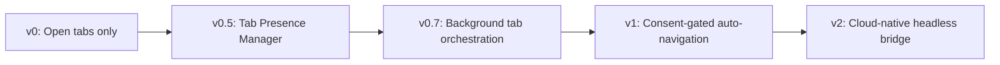
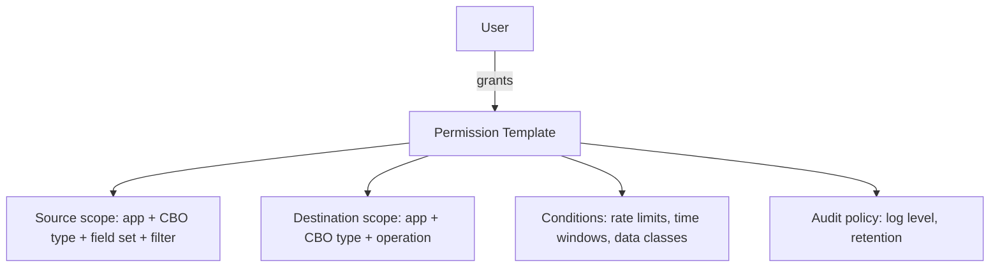
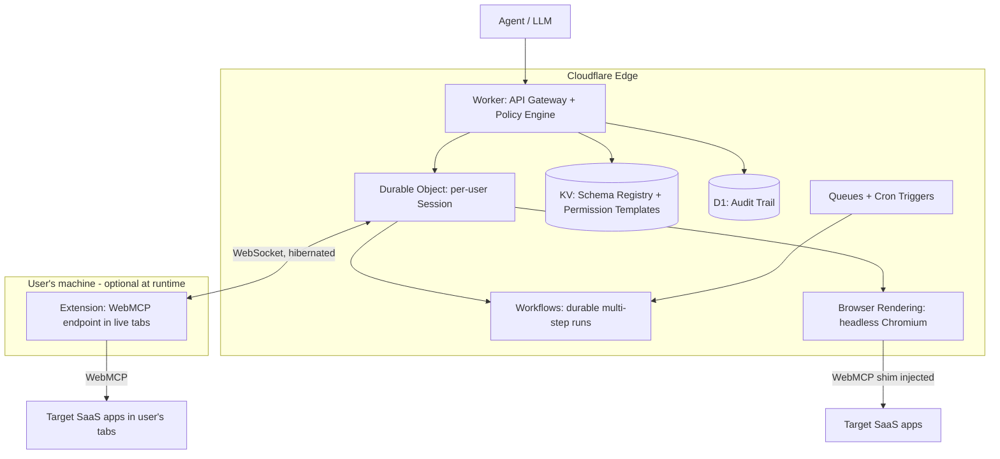

# Connectome: From Concept to Production
## Gap Mitigation, Core Enhancements, and a Cloudflare-Native Architecture

> **Context.** The connectome is a browser-extension-based bridge that connects isolated SaaS apps via WebMCP, letting an AI agent read from and write to apps the user already has open. Prior analysis validated the concept and identified two gaps (v0's reliance on open tabs; v1's UX friction and security risk around automated tab focusing) and two enhancements (a Standardized Schema Registry and Granular Permission Scoping). This document details how to close the gaps, designs both enhancements, and analyzes a fully Cloudflare-native implementation.

---

## 1. Gap Mitigation: The v0 → v1 Transition Plan

### 1.1 The problem restated

| Version | Constraint | Consequence |
|---|---|---|
| **v0** | Target app must be open in an active tab | Agent capability is hostage to the user's tab hygiene; workflows fail silently when a tab is missing |
| **v1 (naive)** | Extension focuses/opens tabs automatically | Jarring UX (tabs stealing focus), and a security surface where an agent can navigate the user's authenticated browser anywhere |

The transition plan below moves through intermediate stages rather than jumping straight to full automation. Each stage adds capability while containing the blast radius of the previous stage's risks.



### 1.2 Stage v0.5: Tab Presence Manager (no automation yet)

Before automating anything, make the *absence* of a tab a first-class, recoverable state instead of a failure:

- **Capability manifest.** The extension maintains a live registry of which connectome-enabled apps are currently reachable (tab open + WebMCP handshake completed). The agent queries this registry before planning a workflow.
- **Graceful degradation.** When a workflow needs an app that isn't open, the agent returns a structured `APP_UNAVAILABLE` result with a one-click affordance: *"Open Linear to continue this workflow."* Clicking opens the tab (user-initiated, so no permission issue) and resumes the paused workflow automatically.
- **Workflow checkpointing.** Multi-app workflows serialize their state so a missing app pauses rather than aborts the run. This checkpointing machinery is reused heavily in later stages.

This stage costs little, ships fast, and converts the v0 gap from "broken" to "one click of friction."

### 1.3 Stage v0.7: Background tab orchestration

The key insight for eliminating focus-stealing: **a tab does not need focus to run WebMCP.** Content scripts and the page's JS context run in background tabs (with throttling caveats). So:

- **Open in background.** Use `chrome.tabs.create({ active: false })` so the user's current tab never loses focus. The user sees a new tab appear in the tab strip, badged by the extension, but their attention is not hijacked.
- **Pinned worker tabs.** Optionally, the extension maintains a small set of pinned, muted tabs for the user's most-used connectome apps (user opts in per app). Pinned tabs are visually compact and signal "this is infrastructure."
- **Beat the throttling.** Chrome throttles timers in background tabs but does not throttle event-driven work. Structure the in-page WebMCP shim around `chrome.runtime` message events (which wake the page) rather than polling loops. Set `chrome.tabs.update(tabId, { autoDiscardable: false })` on worker tabs so Memory Saver does not discard them mid-workflow.
- **Lifecycle hygiene.** Tabs opened by the extension for a workflow are closed when the workflow completes (configurable: "close after use" vs "keep open"). Every extension-opened tab is visually badged so the user always knows which tabs the agent created.

### 1.4 Stage v1: Consent-gated automated navigation

With background orchestration in place, v1 adds the ability to *navigate*: open apps the user hasn't opened, and move within them. This is where the security model must be explicit.

**The consent model, three tiers:**

| Tier | What the agent may do | Consent mechanism |
|---|---|---|
| **Tier 1: Allowlisted origins** | Open/navigate background tabs on origins the user pre-approved (e.g., `app.linear.app`, `*.atlassian.net`) | One-time per-origin grant during app connection, revocable in extension settings |
| **Tier 2: Session grants** | Navigate to origins *not* on the allowlist, for the duration of one workflow | Just-in-time prompt: a non-modal toast, "Agent wants to open Notion for this task [Allow once] [Always] [Deny]" |
| **Tier 3: Never automated** | Banking, healthcare, government, browser-internal pages, and a user-defined denylist | Hard-blocked in the extension; the agent receives `ORIGIN_FORBIDDEN` and must ask the user to act manually |

**Security controls that make v1 safe:**

1. **Origin pinning.** A navigation grant is scoped to an exact origin (scheme + host + port), never a URL pattern the agent composes. The agent requests *"open Linear"*; the extension resolves that to the pinned origin from the app's connection record. The agent never supplies raw URLs for navigation, which kills open-redirect and phishing-via-navigation attacks.
2. **No credential interaction.** The extension refuses to automate any page state it classifies as an auth flow (login forms, OAuth consent screens, MFA prompts). If a background tab lands on a login page, the workflow pauses and surfaces a "sign in to continue" affordance to the user. The agent never sees or touches credentials.
3. **Action budget per workflow.** Each workflow run gets a budget (e.g., max 5 navigations, max 10 tool calls per app) enforced by the extension, not the agent. Budget exhaustion pauses for user confirmation. This bounds the damage of a prompt-injected or malfunctioning agent.
4. **Human-visible audit trail.** Every navigation and cross-app data movement is logged to a local, user-inspectable activity feed ("3:42pm: opened Linear (background), read issue LIN-482, wrote summary to Notion page X"). Trust is built by making the invisible visible.
5. **Kill switch.** A single always-visible control (extension icon → "Pause agent") that instantly freezes all automated activity and closes agent-opened tabs.

**UX friction budget.** The design goal: *zero interruptions for pre-approved flows, exactly one lightweight decision for new ones.* Concretely: Tier 1 flows never prompt; Tier 2 prompts are non-modal toasts that don't steal keyboard focus and default to Deny on timeout; consent decisions are remembered so the same question is never asked twice.

### 1.5 What v1 still cannot do (and why that's fine)

v1 still requires the user's browser to be running and signed in. Workflows cannot run overnight or when the laptop is closed. That residual gap is what the Cloudflare-native architecture in §3 addresses, and importantly, the consent model, schema registry, and permission templates built for v1 carry over unchanged to v2.

---

## 2. Enhancements

### 2.1 Standardized Schema Registry

**Problem.** Every connectome app exposes its own object shapes (a Linear `Issue` vs. a Jira `Issue` vs. an Asana `Task`). Ad-hoc mapping at workflow time is where cross-app data movement becomes unreliable: fields get dropped, types mismatch, and the agent hallucinates mappings under ambiguity.

**Design.** A registry of **Canonical Business Objects (CBOs)**, versioned JSON Schemas for the ~15 objects that cover the vast majority of business workflows, plus per-app **mapping profiles** that declaratively translate between app-native shapes and CBOs.

#### Canonical object catalog (initial set)

| Domain | CBOs |
|---|---|
| Work management | `Task`, `Project`, `Comment`, `Attachment` |
| CRM / Sales | `Contact`, `Company`, `Deal`, `Activity` |
| Communication | `Message`, `Thread`, `Meeting` |
| Documents | `Document`, `Page` |
| Commerce / Finance | `Invoice`, `Order`, `Customer` |

#### Anatomy of a CBO

```json
{
  "$id": "cbo://task/1.2.0",
  "title": "Task",
  "type": "object",
  "required": ["id", "title", "status", "source"],
  "properties": {
    "id": { "type": "string", "description": "Stable ID in the source app" },
    "title": { "type": "string" },
    "status": { "enum": ["backlog", "todo", "in_progress", "blocked", "done", "canceled"] },
    "assignee": { "$ref": "cbo://person/1.0.0" },
    "due_date": { "type": "string", "format": "date" },
    "priority": { "enum": ["urgent", "high", "medium", "low", "none"] },
    "source": {
      "type": "object",
      "properties": {
        "app": { "type": "string" },
        "native_type": { "type": "string" },
        "url": { "type": "string", "format": "uri" }
      }
    },
    "extensions": {
      "type": "object",
      "description": "App-specific fields that have no canonical equivalent, preserved losslessly",
      "additionalProperties": true
    }
  }
}
```

Design decisions worth calling out:

- **Closed enums with escape hatches.** `status` is a closed canonical enum; mapping profiles declare how native statuses fold into it (Linear's `Triage` → `backlog`). The original native value is always preserved in `extensions`, so round-trips are lossless.
- **`source` block is mandatory.** Every CBO instance knows where it came from, enabling provenance display in the audit trail and correct write-back routing.
- **Semantic versioning.** `cbo://task/1.2.0`: minor versions add optional fields only; major versions may break. Mapping profiles pin the major version they target, so a registry update never silently breaks a deployed profile.

#### Mapping profiles

A mapping profile is a declarative document (not code) that the extension or bridge executes deterministically:

```yaml
profile: linear-issue-to-cbo-task
cbo: cbo://task/1.x
app: linear
native_type: Issue
fields:
  id: .identifier
  title: .title
  status:
    from: .state.type
    map: { triage: backlog, unstarted: todo, started: in_progress, completed: done, canceled: canceled }
  assignee: { from: .assignee, via: linear-user-to-cbo-person }
  due_date: .dueDate
write_back:
  allowed_fields: [title, status, assignee, due_date, priority]
  status: { to: .stateId, resolve: lookup_state_by_type }
```

- **Deterministic first, LLM as fallback.** The profile covers the mapping deterministically. Only when a workflow encounters an unmapped field does the agent propose a mapping, and that proposal is surfaced to the user ("Map Linear's `cycle` to Task's `extensions.cycle`?") and, if accepted, persisted into the profile. The registry thus *learns*, and reliability improves monotonically instead of depending on per-run LLM behavior.
- **Community + first-party profiles.** Ship first-party profiles for the top 20 apps; allow community-contributed profiles with a signing/review process, exactly like extension stores handle third-party code, but with far lower risk since profiles are declarative data.
- **Validation at the boundary.** Every object crossing apps is validated against its CBO schema before write-back. A validation failure produces a structured, user-visible error rather than a corrupt write.

### 2.2 Granular Permission Scoping via Permission Templates

**Problem.** "App A can talk to App B" is far too coarse. Users will not (and should not) grant an agent blanket read/write across their SaaS estate. But prompting on every single data movement is unusable. Permission templates resolve the tension: **pre-approved, named, inspectable flows.**

#### The permission object model



A template is a signed JSON document:

```json
{
  "template_id": "standup-summary-v1",
  "name": "Post daily task summaries to Slack",
  "source": {
    "app": "linear",
    "cbo": "cbo://task/1.x",
    "fields": ["title", "status", "assignee.display_name"],
    "filter": "status changed within 24h AND assignee = me"
  },
  "destination": {
    "app": "slack",
    "cbo": "cbo://message/1.x",
    "operation": "create",
    "constraint": "channel in [#standup]"
  },
  "conditions": {
    "max_invocations": "1/day",
    "data_classes_forbidden": ["pii.email", "pii.phone", "secrets"],
    "valid_until": "2027-01-01"
  },
  "audit": { "level": "full_payload", "retention_days": 30 }
}
```

Key properties:

1. **Field-level, not app-level.** The template names exactly which CBO fields may leave the source app. `assignee.display_name` may flow; `assignee.email` may not. Because templates are expressed against CBOs (not raw app payloads), one template design works across every app that maps to that CBO.
2. **Direction and operation are explicit.** Read-from-A-write-to-B is a different grant than the reverse. Operations are enumerated (`create`, `update`, `read`), so a summarize-to-Slack template can never delete anything.
3. **Data-class firewall.** Fields in CBO schemas carry data-class annotations (`pii.email`, `financial.amount`, `secrets`). Templates can forbid classes wholesale, and the enforcement layer blocks any payload containing a forbidden class even if a field mapping would technically allow it. This is a second, independent line of defense.
4. **Template lifecycle & UX.** Templates are proposed by the agent in plain language + inspectable detail ("This will read task titles and statuses from Linear once a day and post to #standup. It cannot read emails or post anywhere else."), approved once, listed in a permissions dashboard, individually revocable, and auto-expiring. First-run of any template executes in "dry-run + show me" mode: the user sees exactly what would move before the first real execution.
5. **Enforcement point is not the agent.** Templates are enforced by the extension (v1) or the edge gateway (v2) - a deterministic policy engine that sits between the agent and the apps. A prompt-injected agent can *request* anything; it can only *do* what an approved template permits.

Together, the schema registry and permission templates form a natural pair: **CBOs define what data *is*; templates define where it may *go*.**

---

## 3. Cloudflare-Native Implementation

### 3.1 The short answer

**Yes, a totally Cloudflare-native connectome is possible**, and it is arguably the most natural cloud home for this architecture. Every component the connectome needs maps to a Cloudflare primitive with no gaps requiring outside infrastructure:

| Connectome component | Cloudflare primitive | Why it fits |
|---|---|---|
| Agent runtime / orchestrator | **Workers** (+ Workers AI or external LLM APIs) | Stateless request handling at the edge; sub-ms cold starts for tool-call fan-out |
| Per-user session & workflow state | **Durable Objects** | Single-threaded, strongly consistent, addressable-by-ID state; the canonical fit for "one user's live workflow" |
| Real-time link to browser extension | **Durable Objects + WebSocket Hibernation API** | Holds thousands of idle extension sockets at near-zero cost |
| Headless app interaction (no browser open) | **Browser Rendering** (managed headless Chromium via Puppeteer/Playwright APIs) | Runs the same WebMCP shim inside a cloud browser session |
| Schema Registry (CBOs + mapping profiles) | **KV** (read-heavy, globally cached) + **R2** (versioned schema archive) | Registry reads happen on every workflow; KV's edge cache makes them free-ish |
| Permission templates & policy engine | **KV** for template storage; enforcement in the Worker gateway | Templates are small, read-often, write-rarely: KV's exact sweet spot |
| Audit trail | **Workers Analytics Engine** or **D1** (relational, per-user) | Queryable audit log with retention policies |
| Workflow scheduling (overnight runs) | **Cron Triggers** + **Queues** | Time-based and event-based execution without any server |
| Long multi-step workflows | **Workflows** (durable execution) | Retries, checkpoints, and human-in-the-loop pauses as a managed primitive |
| Secrets (app tokens where APIs exist) | **Workers Secrets / Secrets Store** | Never touches the client |

### 3.2 The architectural shift: extension-as-bridge → extension-as-endpoint

The deep change is not swapping hosting; it is inverting the topology. In v0/v1, the extension *is* the bridge: orchestration, mapping, and policy all live client-side, and everything dies when the browser closes. In the Cloudflare-native design, the bridge moves to the edge and the extension becomes just one of two interchangeable **execution endpoints**:



**Routing rule inside the Session DO:** for each tool call, prefer the user's live extension endpoint if the target app's tab is open (free, uses the user's existing session, zero cloud browser cost); otherwise fall back to a Browser Rendering session. The agent code is identical either way, because both endpoints speak the same WebMCP protocol. This is the elegant part: *v1 and v2 are not different products; they are two transports for the same bridge.*

### 3.3 Component deep-dives

#### Durable Objects: the session brain

One Durable Object per user (`idFromName(userId)`) owns:

- The **WebSocket to the extension**, using the Hibernation API so an idle connected user costs essentially nothing. When the extension reconnects (browser restart), it re-attaches to the same DO and state is intact.
- **Workflow state machine**: the checkpointing designed in §1.2 serializes into the DO's transactional storage, so a workflow paused for consent or a login survives deploys and disconnects.
- **Endpoint registry**: which apps are reachable via the extension right now vs. which need a cloud browser.
- **Serialization guarantees**: DOs are single-threaded, so two concurrent workflows can never race on the same app session, which matters enormously when both would write to the same Notion page.

#### Browser Rendering: the headless endpoint

Cloudflare Browser Rendering exposes managed headless Chromium driven via Puppeteer/Playwright from a Worker. The connectome uses it as follows:

1. The Session DO requests a browser session (sessions can be kept warm and reused across calls with `browser.sessions` reuse to amortize startup).
2. The Worker injects the **same WebMCP shim** the extension injects into live tabs, so the page exposes identical tools.
3. **Auth is the hard part, solved honestly:** the cloud browser needs its own authenticated session with the SaaS app. Options, in order of preference:
   - **Native API + OAuth where available.** If the app has a real API, skip the browser entirely; the connectome's WebMCP tool surface is backed by API calls from the Worker with tokens in Secrets Store. Browser Rendering is the fallback for apps without APIs.
   - **Dedicated cloud session.** The user performs a one-time interactive login *into* the cloud browser (streamed to them via a remote-view page during onboarding); the resulting cookies are encrypted and stored in the DO's storage, scoped per user per app. Refresh handled by re-prompting on expiry.
   - **Never silently copy cookies out of the user's local browser.** Technically possible via the extension; ethically and security-wise a hard no. Session material only ever moves with an explicit, per-app, informed grant, and the permission templates from §2.2 still gate every data movement regardless of transport.
4. **Limits to design around:** Browser Rendering has concurrency and session-duration limits per account; the Session DO queues tool calls per app, and Queues absorbs burst load. Long-lived "always-on" cloud sessions should be the exception (scheduled workflows spin sessions up on demand via Cron Triggers).

#### Workers + Workflows: orchestration without servers

- The **gateway Worker** terminates every agent request, evaluates permission templates (deny-by-default), validates payloads against CBO schemas from KV, writes the audit record, and only then forwards the call to the Session DO. The policy engine being *in front of* the DO means even a compromised agent prompt cannot bypass it.
- **Cloudflare Workflows** gives durable execution for multi-step, long-horizon runs: each step (read from app A, transform, request consent, write to app B) is a checkpointed step with automatic retries; a human-in-the-loop consent pause is just a step that sleeps until an event arrives, for hours or days, at no compute cost.
- **Cron Triggers** make the connectome *proactive*: the daily-standup template from §2.2 runs at 9am whether or not the user's laptop is open, using Browser Rendering or native APIs as the endpoint.

#### KV, R2, D1: the data layer

- **KV** holds CBO schemas, mapping profiles, and permission templates: small JSON documents, read on every workflow, updated rarely, globally cached at the edge. Eventual consistency is acceptable because schemas and templates are versioned and pinned.
- **R2** archives every schema/profile version immutably (compliance, rollback, community review).
- **D1** stores the per-user audit trail relationally so users can query "show me everything that touched my CRM last week." For very high volume, Workers Analytics Engine handles aggregate telemetry while D1 keeps the user-facing log.

### 3.4 Implementation roadmap

| Phase | Scope | Cloudflare pieces |
|---|---|---|
| **P1** | Move policy engine + schema registry to the edge; extension becomes a dumb endpoint | Workers, KV, D1 |
| **P2** | Per-user Session DO with hibernated WebSocket to extension; workflow checkpointing in DO storage | Durable Objects |
| **P3** | Durable multi-step runs + scheduled workflows | Workflows, Queues, Cron Triggers |
| **P4** | Headless endpoint: Browser Rendering with WebMCP shim injection + per-app cloud auth onboarding | Browser Rendering, Secrets Store |
| **P5** | Hybrid routing (extension-first, cloud-fallback), template marketplace, org-level admin | All of the above |

### 3.5 Honest caveats

- **Cloud auth is consent-heavy by design.** The one-time interactive login into the cloud browser is real onboarding friction per app. It is the correct trade: the alternative (exfiltrating local cookies) is unacceptable, and apps with real APIs skip it entirely.
- **Browser Rendering costs and limits** make "a cloud browser per user per app, always on" the wrong mental model. Design for on-demand sessions with reuse, and treat the user's own extension as the free fast path.
- **Anti-bot friction.** Some SaaS apps will challenge datacenter-originated headless browsers. Mitigations: prefer native APIs, keep sessions warm and human-established, and keep the extension path as the universal fallback.
- **DO placement vs. app latency.** A Session DO lives in one location; calls to SaaS apps hosted elsewhere add latency. Acceptable for workflow automation (seconds, not milliseconds); use Smart Placement to co-locate DOs near the user's traffic.

---

## 4. Summary

- **v0 → v1** is a staged path: make missing tabs recoverable (v0.5), orchestrate in background tabs so focus is never stolen (v0.7), then add navigation behind a three-tier, origin-pinned consent model with action budgets, an audit feed, and a kill switch (v1).
- **The Schema Registry** (versioned Canonical Business Objects + declarative mapping profiles) turns cross-app mapping from a per-run LLM gamble into a deterministic, learning system.
- **Permission Templates** provide field-level, direction-explicit, data-class-aware grants enforced outside the agent, so one approval covers a recurring flow without per-action prompts.
- **A fully Cloudflare-native build is feasible and clean**: Workers as the policy gateway, Durable Objects as per-user session brains, Workflows/Queues/Cron for durable and scheduled execution, KV/R2/D1 as the registry and audit layer, and Browser Rendering as the headless WebMCP endpoint, with the browser extension retained as the free, user-session fast path. The architectural shift is from *extension-as-bridge* to *extension-as-one-endpoint of an edge-native bridge*, which finally removes the "browser must be open" constraint entirely.
